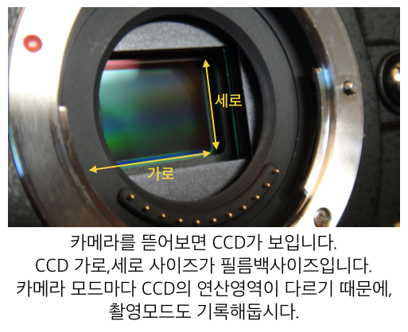
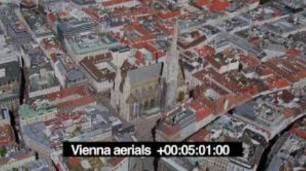

# Analysis

## 컨텐츠 매체점검

* 제작 하려는 매체가 무엇인지 체크합니다. 예\) 영화, 에니메이션, 드라마, 광고, 입체영상, VR, 전시영상, 특수영상
* 매체에 따러서 작업하는 방식이 다를 수 있습니다.

## 작업전 샷 분석방법.

* 편집본 확인 : 보통 영화의 경우에는 작업전 전체 영상파일로 전체 느낌을 알 수 있는 편집파일이 있습니다. 참고하세요.
* 제작관련 컨셉이미지, 레퍼런스가 있다면 확인합니다.
  * [https://www.youtube.com/watch?v=q96u-I2UF5c](https://www.youtube.com/watch?v=q96u-I2UF5c)
* 샷 분석 회의를 합니다. Shot Breakdown
  * [https://www.youtube.com/watch?v=nawbpZOKpD8](https://www.youtube.com/watch?v=nawbpZOKpD8)
* 일반적이지 않은 촬영기법을 사용했다면 체크합니다.
  * 타임랩스 : [https://drive.google.com/open?id=0B3O\_eJlmdgJVMjRBempHVzJseWM](https://drive.google.com/open?id=0B3O_eJlmdgJVMjRBempHVzJseWM)
  * Day for Night
* 카메라 종류 및 렌즈mm 확인
  * 이 책에서 사용되는 예제플레이트는 Black magic pocket camera로 촬영되었습니다.
  * 제품 홈페이지 : [https://www.blackmagicdesign.com/products/blackmagicpocketcinemacamera](https://www.blackmagicdesign.com/products/blackmagicpocketcinemacamera)
  * 사용 렌즈 : Panasonic 20mm f1.7 AOV
  * 제 카메라는 2.88 크롭바디 특성이 있습니다. 20mm렌즈를 장착했을 때 20 \* 2.88 = 57.6mm 느낌으로 촬영됩니다.
  * 새로운 렌즈, 카메라등을 잘 테스트하는 사람의 유튜브 주소입니다. 개인적으로 도움이 많이 됩니다. : [https://www.youtube.com/channel/UCgVwlIabrL100C9\_6vyM9-g](https://www.youtube.com/channel/UCgVwlIabrL100C9_6vyM9-g)
* 필름백 사이즈 확인
  * 예제 파일에 사용된 CCD size 입니다. : 12.48 x 7.02mm / 이 책의 플레이트로 테스트시 필요하다면 이 값을 사용하세요.

    
* 렌즈 디스토션 사이즈 확인 및 렌즈왜곡 촬영
  * 실제 촬영이 되면 렌즈로 인한 왜곡이 생깁니다. CG작업 전에는 이미지의 왜곡을 펴야합니다.
  * 이 책에서 사용되는 예제의 렌즈디스토션 촬영 이미지 링크를 아랫줄에 추가합니다.
  * 렌즈디스토션 챠트 : [https://github.com/khw7096/bmpcc/blob/master/lensdist/lensdisto.jpg](https://github.com/khw7096/bmpcc/blob/master/lensdist/lensdisto.jpg)
* 카메라와 연결된 리그분석 : 보통 어떤 영상은 리그를 자체자작하기도 합니다. 보통은 시중에 파는 리그를 많이 사용합니다.
  * 세상에는 많은 리그들이 존재합니다. 모양들을 구경해보세요.
  * [https://www.google.co.kr/search?newwindow=1&biw=1280&bih=1303&tbm=isch&sa=1&q=cinema+camera+special+rig&oq=cinema+camera+special+rig&gs\_l=img.3...18895.23888.0.24033.18.15.1.0.0.0.351.1803.2-6j1.7.0....0...1c.1.64.img..10.3.474.1k7y1HQl7oE](https://www.google.co.kr/search?newwindow=1&biw=1280&bih=1303&tbm=isch&sa=1&q=cinema+camera+special+rig&oq=cinema+camera+special+rig&gs_l=img.3...18895.23888.0.24033.18.15.1.0.0.0.351.1803.2-6j1.7.0....0...1c.1.64.img..10.3.474.1k7y1HQl7oE)
* 작업내용을 분석합니다.
* 최종 렌더링 사이즈를 점검합니다. \(가로픽셀, 세로픽셀\)
* 컬러스페이스 : 데이터를 받을 때, 데이터가 나갈때의 컬러스페이스가 다를 수 있습니다.
* FPS : 초당 연산할 프레임 수 입니다.
* LUT 확인
* 타임코드를 이용해서 실제 작업해야하는 구간을 체크합니다. IN/OUT

  

