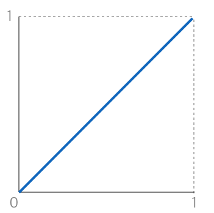
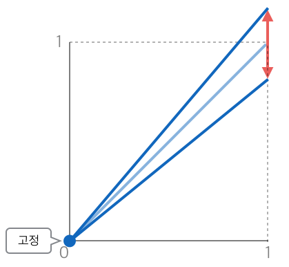

# ColorCorrection

* 이해를 돕기 위해서 커브 형태로 설명하겠습니다.
* 포토샵의 커브를 혹시 알고계신다면 많은 도움이 될 수 있습니다.
* 천천히 이해해 봅시다.

## default

* 아무 색상이 바뀌지 않는 상태의 커브 입니다. 

## Offset

* 모든 이미지의 밝기를 올리거나 낮춥니다.
* 블랙 레벨을 바꿀 때 사용합니다.
* 색이 움직이는 그래프는 다음과 같습니다.
* 다른 용어로 lift, brightness 라고 불리는 툴도 있습니다.

## Gain

* 로우레벨을 고정시킨 상태에서 하일라이트만 조정할 때 사용합니다.
* 화이트 레벨의 컬러컬렉션을 할 때 사용합니다.
* 색이 움직이는 그래프는 다음과 같습니다.

## Gamma

* 로우톤과, 하일라이트 톤을 고정시킨 상태로 미들톤을 조정합니다.
* 색이 움직이는 그래프는 다음과 같습니다.

## Contrast

* 이미지의 대비를 줄 때 사용합니다.
* 그래프로 설명하면 아래와 같습니다.

## Clamp

* 특정 색영역을 잘라내기 위해서 사용합니다. 영역은 보통 사용자가 설정합니다.
* 그래프로 설명하면 아래와 같습니다.

## Low, Middle, Hi

* 이미지는 로우톤, 미들톤, 하일라이트 톤으로 이루어져 있습니다.
* 어떤 책에서는 미학적인 관점에서 더 세부적으로 분류를 하는 경우도 있지만, 이 책은 학술지가 이니니 일단 3개로 분류합시다.
* 색 영역을 라인으로 구분해 보았습니다.
* 뉴크 Color Correction 노드에서는 RangeTab에서 test를 키고 low, middle, hi zone을 설정할 수 있답니다.

## Nuke Range

* 친구 집앞에 있는 카페를 찍어보았습니다. 새벽인데 전등 하나는 켜고 퇴근하는 군요.

  

  

* 예제파일 : [https://drive.google.com/open?id=0B3O\_eJlmdgJVSzU3Y01vVWxhVGM](https://drive.google.com/open?id=0B3O_eJlmdgJVSzU3Y01vVWxhVGM)

## Natron의 Ranges

## 일반적인 색보정 순서

* 색보정의 일반 순서를 작성합니다. 일반적인 순서이며, 아티스트의 역량, 노하우에 따라 얼마든지 다를 수 있습니다.
* 가장 낮은 블랙 레벨을 잡습니다. 그래프의 전체를 움직이게 됩니다. - offset
* 가장 밝은 화이트 레벨을 잡습니다. 이미지의 가장 밝은 픽셀을 선택하게 됩니다. - gain
* 중간영역의 톤을 잡습니다. 중간 영역의 디테일을 살려줍니다. - gamma
* 위 까지 진행되면 Primary Color Correction 이라고 합니다. 보통 DI툴 인터페이스의 첫번째에 많이 있어요.
* 암부, 중간, 하일라이트 톤을 미세하게 다시 잡아줍니다.
* 위 단계를 거치면 Secondary Color Correction 이라고 합니다. 보통 DI툴의 새부 옵션등에 있습니다.
* 이후 필요 영역을 Rotoscoping 해서 좀더 사용자의 생각대로 색보정을 이끌어 나갑니다.

## 용어설명

* DI툴 : Digital Intermediate 라고 합니다. 아래 툴들이 많이 사용됩니다.
* Davinci Resolve : [https://www.blackmagicdesign.com/kr/products/davinciresolve](https://www.blackmagicdesign.com/kr/products/davinciresolve)
* Assimilate Scratch : [http://www.assimilateinc.com/products/](http://www.assimilateinc.com/products/)
* 다른 제품도 많습니다. 이후 생각나면 적겠습니다.

## 관련링크

* Zone System\(존 시스템\) : [https://en.wikipedia.org/wiki/Zone\_System](https://en.wikipedia.org/wiki/Zone_System)

