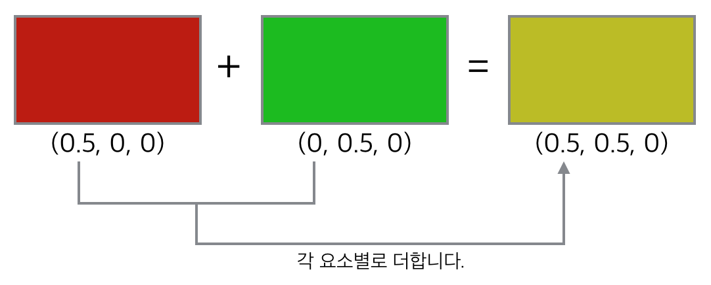
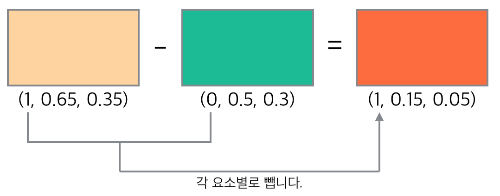
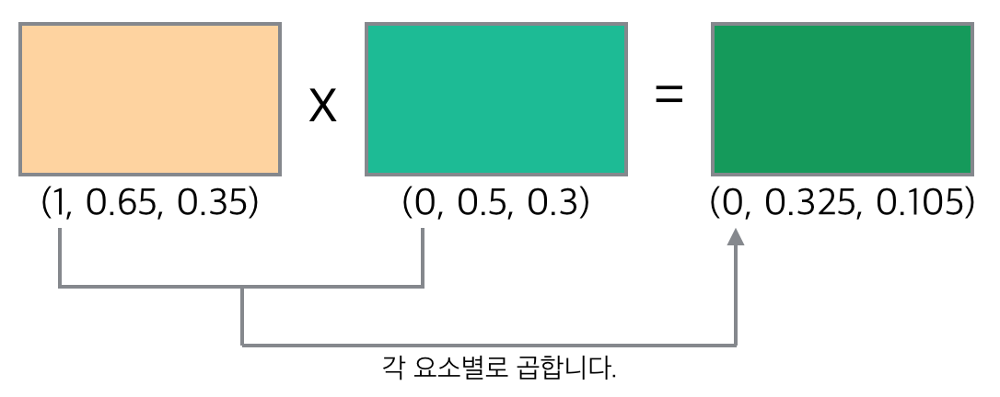
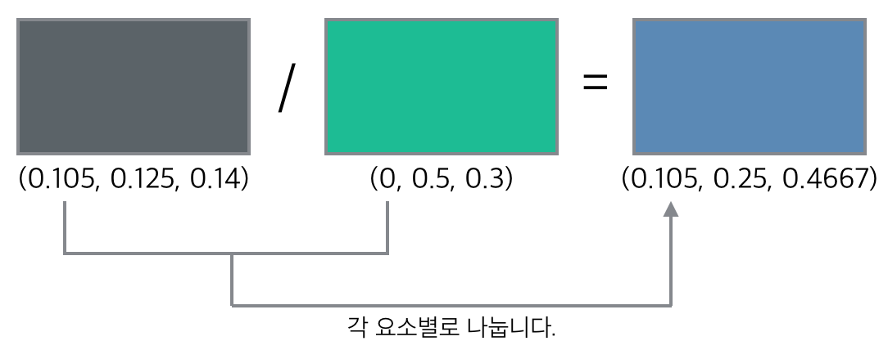

# Mathop

* Nuke 는 소수점\(float\)으로 컬러를 표기합니다.
* Natron 도 소수점\(float\)으로 컬러를 표기합니다.
* 그리고 모든 컬러 및 이미지 연산은 float로 연산됩니다.

### float 란?

* 최초 컴퓨터에서는 컬러를 표현할 때 흑과 백 2가지 색상을 표현했습니다. 0,1 다른 의미로 2의 1제곱의 색 이었습니다.
* 시간이 흘러.. 2의 2제곱 즉 4가지 색. 2의 3제곱 8가지 색.. 등이 발전하게 됩니다.
* 2의 8제곱이 그 후 널리 쓰이게 됩니다. 256가지 색상이죠. 0~255 단계의 색이기도 합니다. 8비트 색으로도 불렸습니다.
* 디자인 작업시에는 8비트 색으로도 보통은 충분합니다.
* 이후 사람들은 매체에 따라서 좀더 많은 색상을 저장하기 원했습니다.\(더 많은 정보, 노출값 저장..\)
* 코닥은 필름을 디지털로 바꾸기 위해서 2의 10제곱의 컬러를 저장하는 Log 컬러스페이스를 만들기도 했습니다.
* 계속 그래픽스가 발전하면서 최근 툴들은 2의 16제곱 16비트 컬러, 2의 32제곱. 32비트 컬러들을 처리할 수 있게 됩니다.
* 기존에는 정수\(int\)통해서 색을 연산할 수 있었지만, 16비트 32비트등.. 많은 색을 표현하기에는 정수는 힘들게 됩니다.
* 다른 표기법이 필요했고 소수를 사용하는 것은 꽤 괜찮은 방법이라고 생각했습니다.
* 0 ~ 1 사이에는 무수한 소수들이 존재하니까요. 그 수를 이용하면 색의 많은 단계를 수학적으로 표현할 수 있습니다.
* 기억해 두세요. 뉴크는 색을 다룰 때 소수로 처리합니다.

## 색의 표기법

* 빛의 3원색의 조합으로 색은 만들어집니다.
* 빨강은 Red값이 1, Green값이 0, Blue 값이 0 입니다.
* 표기로 \(1,0,0\) 이라고 적겠습니다.

## 더하기 \( + \)

## 빼기 \( - \)

## 곱하기 \( \* \)

* 보통 0을 다른 컬러와 곱하면 0이 되기 때문에 마스크 연산에서 자주 사용합니다.
* 1과 픽셀을 곱하면 언제나 자기 자신의 픽셀이 나옵니다.

## 나누기 \( / \)

* 자신의 픽셀 나누기 자신의 픽셀은 1이 됩니다. 이 특징을 이용하는 연산에 사용합니다.
* 0으로 특정 픽셀을 나누면 에러가 납니다.

## 자세히

* 픽셀 연산에서 4칙 연산은 기본이 됩니다.
* 대부분 4칙 연산을 이용해서 합성 작업시 응용을 하게됩니다.
* 합성을 하면서 에러를 만나게 되었을 때 4칙 연산을 통해서 검증해보면, 결과에 당황하지 않고 에러들을 처리할 수 있습니다.

