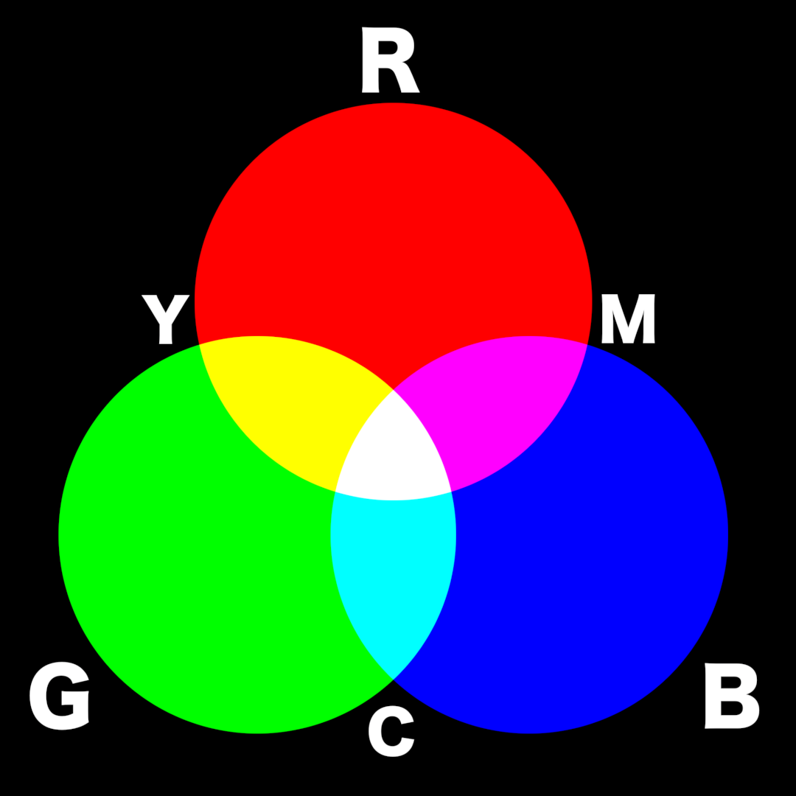

# rgb

* 합성은 빛의 3원색을 사용합니다. Red, Green, Blue. 줄여서 RGB 라고 합니다.
* R 과 G 를 섞으면 노랑색이 나옵니다.
* G 와 B 를 섞으면 싸이언색이 나옵니다.
* R 과 B 를 섞으면 마젠타 색이 나옵니다.
* 모든 색상이 섞이면 흰색이 나옵니다.
* 위 개념은 추후 색보정에서 상당히 중요합니다. 꼭 외워주세요.

## 응용을 한다면..

* 이미지가 전체적으로 노란색 기운이 돕니다. 붉은 기운으로 바꾸고 싶다면..
  * 방법 : 그린을 약간 내립니다.
* 이미지가 붉은 기운이 도는데, 붉은 기운 자체를 없애고 싶다면..
  * 방법1 : 그린, 블루를 추가합니다.
  * 방법2 : 레드를 낮춥니다.
* 모니터 캘리브레이션을 할 때도 위 기술이 적용되어서 모니터의 RGB 수치를 컨트롤 할 수 있습니다.

## 이 페이지에 나오는 도안의 뉴크파일.

* [https://drive.google.com/open?id=0B3O\_eJlmdgJVT3hHWTRVbGg0QVk](https://drive.google.com/open?id=0B3O_eJlmdgJVT3hHWTRVbGg0QVk)

