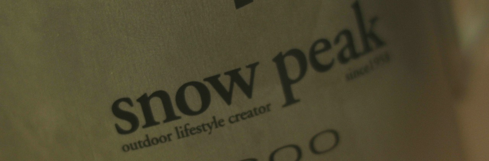
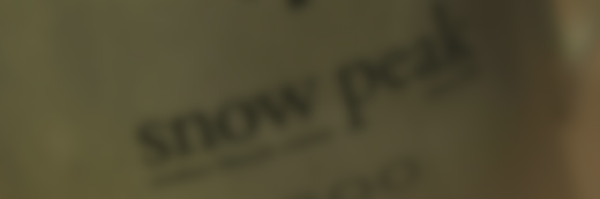

# Blur

* 이미지를 흐리게 할 때 사용합니다.
* 보통 알파를 가진 마스크의 엣지를 좀더 퍼트릴 때도 많이 사용합니다.
* 원본 이미지 입니다. 제가 사용하는 물컵의 로고입니다. 

  

* Blur를 주었습니다. 보통 초보자는 Defocus와 Blur를 해깔립니다. 

  

* 다음 Defocus 페이지에서 다시 차이점을 알아보겠습니다.

