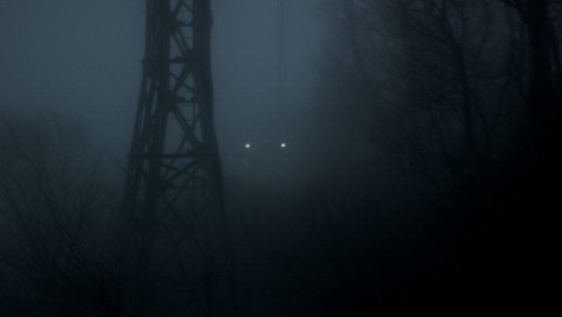
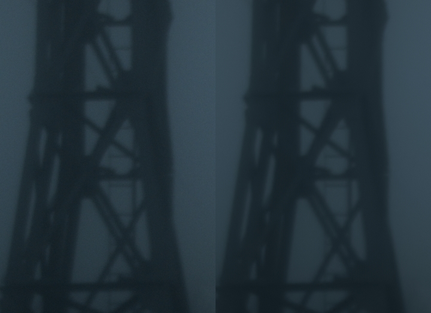

# CameraNoise

* 입자를 잘 보기 위해서 안개가 많이 낀 이미지를 준비했습니다.
* 예제파일 : [https://drive.google.com/open?id=0B3O\_eJlmdgJVLTV5QURVcDQ4LXM](https://drive.google.com/open?id=0B3O_eJlmdgJVLTV5QURVcDQ4LXM)
* 뉴크 Denoise로 노이즈를 제거해 보았습니다.

  

* 이미지의 입자를 자세히 보면 픽셀에 카메라 노이즈와 제거된 노이즈가 보입니다.
* 사용한 뉴크 씬입니다. : [https://drive.google.com/open?id=0B3O\_eJlmdgJVMms3VzNWUjR4elk](https://drive.google.com/open?id=0B3O_eJlmdgJVMms3VzNWUjR4elk)
* ISO 값에 따라서 노이즈의 세기가 다릅니다.
* 이 값은 트레킹, Keying 작업에 영향을 줄 수 있습니다. 이런 작업 전에 Denoise 를 하게되면 더 좋은 결과를 얻을 수 있습니다.
* 과거 필름 작업을 할 때는 인화 과정에서 Grain이 생성됩니다. Grain과 CameraNoise는 다르답니다.
* Grain과 Noise를 해깔리지 마세요.

## Link

* Grain : [https://en.wikipedia.org/wiki/Film\_grain](https://en.wikipedia.org/wiki/Film_grain)
* CCD Noise : [http://qsimaging.com/ccd\_noise.html](http://qsimaging.com/ccd_noise.html)
* Image Noise : [https://en.wikipedia.org/wiki/Image\_noise](https://en.wikipedia.org/wiki/Image_noise)

## Natron

* Natron에서 디노이즈 하면 다운됩니다. 버젼:2.0.2

