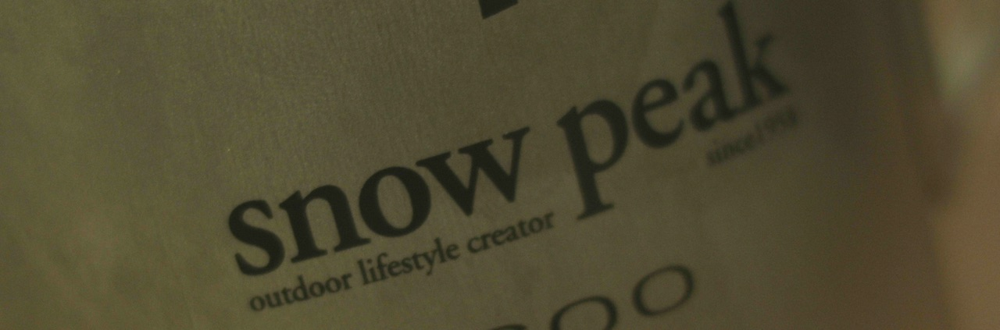
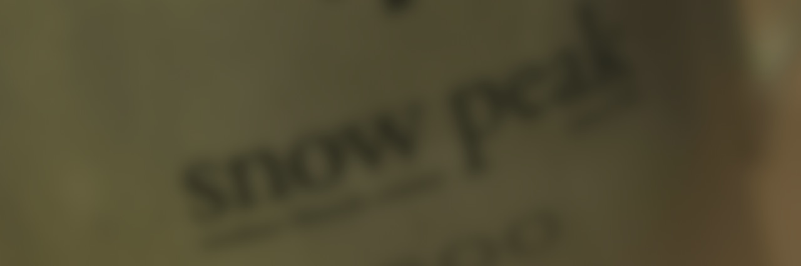

# Defocus

* 이미지를 포커스 아웃 할 때 사용합니다.
* 원본이미지 입니다. 

  

* 기존 Blur 이미지 입니다. 

  

* 실제 렌즈 디포커스 입니다. 

  

* 뉴크에서 Defocus 노드를 이용한 "Digital Defocus"입니다. 

  

* 역시 가장 리얼해 보이는것은 실제로 촬영된 Defocus 이구요, 다음이 뉴크 Defocus 입니다. 포커스 아웃할 때는 Blur노드는 사용하지 않습니다.

