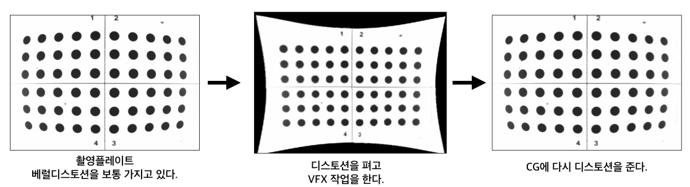

# Lens\_Distortion

* 렌즈를 통해본 세상은 왜곡되어 보입니다. 

  

* 디스토션의 종류입니다. 여러타입이 있지만 보통 2가지 형태, 또는 두가지가 섞인 형태도 있습니다. 

  

* VFX작업은 왜곡이 없는 이미지로 작업 해야합니다. 그래서 왜곡을 펴서 작업하는 아래와 같은 과정을 거치게 됩니다.
* Nuke나 Maya같은 툴의 3D환경의 카메라는 렌즈왜곡이 없기 때문입니다.

  

