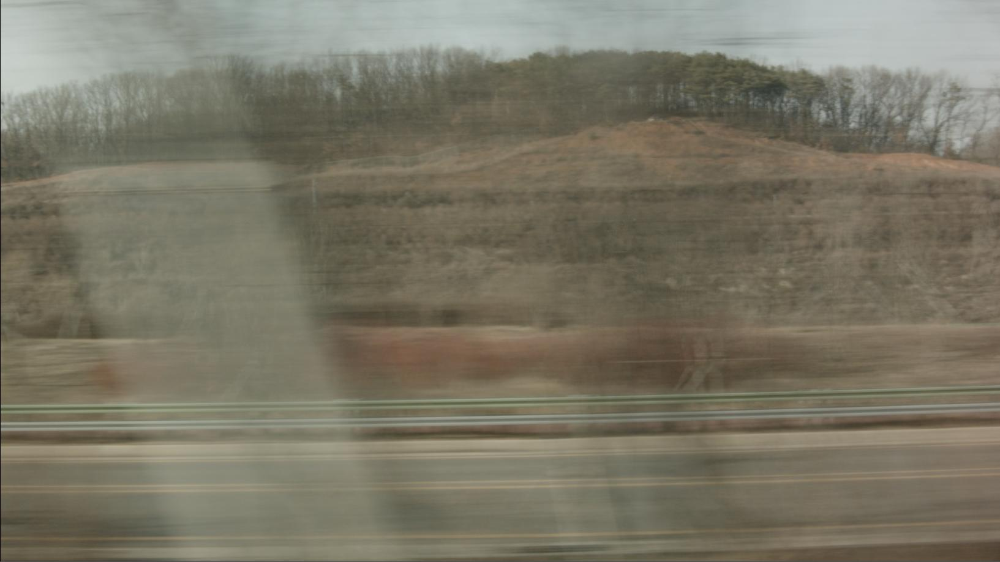

# Rolling\_shutter

* 빠르게 달리는 차안에서 제 카메라로 촬영을 해보았습니다.
* 맨 앞에 대각선으로 보이는 흐릿한 흰색 막대는 가로등입니다.
* 분명 촬영당시에는 곧은 수직으로 세워져 있지만 기울여져서 촬영되었네요.
* 카메라의 CCD 픽셀 레코딩 속도보다 제가 타고있는 버스의 스피드가 빨라서 생긴 현상입니다.
* 레코딩은 위에서 아래로 가로 한줄씩 순서대로 레코딩 되기 때문에 맨 첫줄 픽셀과 맨 마지막줄의 픽셀이 레코딩 되는 시간은 미묘하게 차이가 납니다.
* 제 카메라처럼 저가형 카메라로 촬영하면 이런 현상들이 많이 나타납니다.
* 이미지가 약간 좌우로 뒤틀려서 찍히거나, 직선이 대각선으로 찍히는 현상들이 나타납니다.
* 회전하는 물체에서도 많이 일어납니다.
* 이러한 현상을 "롤링셔터" 현상이라고 합니다.
* 보통 고가의 영화용 카메라에서는 없거나 이러한 현상이 아주 미묘하게 나타기 때문에 눈에 띄지 않습니다.

## link

* 예제파일 : [https://drive.google.com/open?id=0B3O\_eJlmdgJVOXRaVmQ4RHROSDA](https://drive.google.com/open?id=0B3O_eJlmdgJVOXRaVmQ4RHROSDA)

