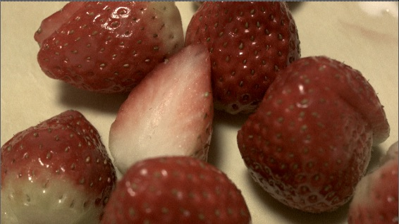
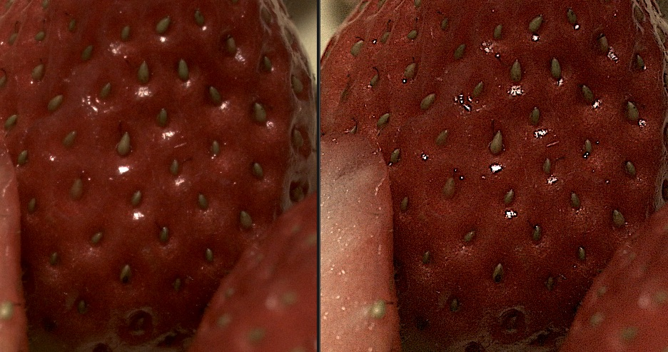
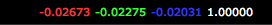

# Sharpen

* 샤픈은 이미지를 선명하게 보이도록 하는 기술입니다. 

  

* 제가 예전에 먹던 딸기 이미지로 샤픈을 테스트 해보겠습니다.
* 예제파일  : [https://drive.google.com/open?id=0B3O\_eJlmdgJVQUZVbFMtUjcyUmc](https://drive.google.com/open?id=0B3O_eJlmdgJVQUZVbFMtUjcyUmc)
* 1:1로 확대해 보겠습니다.

  

* 이미지에 Sharpen을 줄 때는 조심조심 적용해야 합니다.
* 주변픽셀과 미분되기 때문에 픽셀이 음수값이 나올 수 있습니다. 어두운 픽셀에 마우스를 올리고 RGB값을 확인해봤습니다.

  

## 뉴크파일

* [https://drive.google.com/open?id=0B3O\_eJlmdgJVM3VIU2ZvdC1YSDA](https://drive.google.com/open?id=0B3O_eJlmdgJVM3VIU2ZvdC1YSDA)

## Natron에서는

* SharpenInvDiff 노드를 사용합니다.

