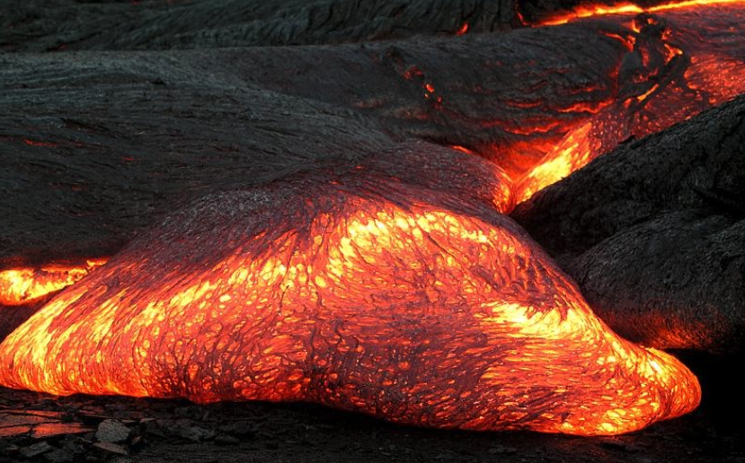
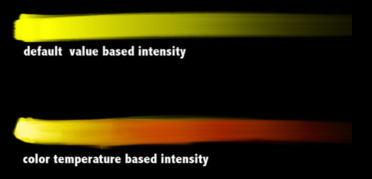
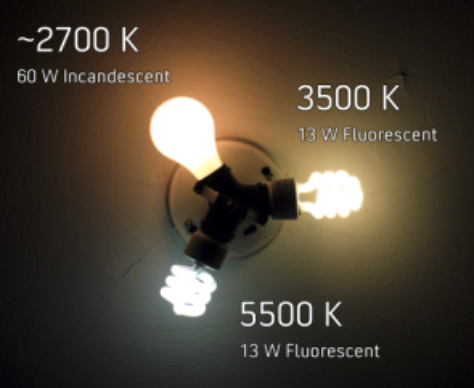
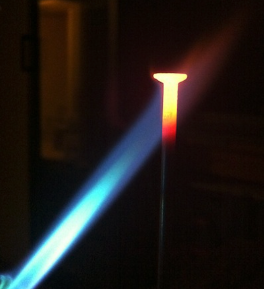

# Temperature

* 어디가 가장 뜨거운 부분인지 우리는 본능적을 알 수 있습니다. 생활하면서 색온도에 대한 정보를 학습했기 때문입니다.

* 촛불 플레이트 DNG 오리지털 데이터 : [https://drive.google.com/open?id=0B3O\_eJlmdgJVal94UExVWlpYZmM](https://drive.google.com/open?id=0B3O_eJlmdgJVal94UExVWlpYZmM)

* 초보자들은 색을 위 패턴처럼 사용하며, 고수들은 아래 형태처럼 사용해서 온도를 표현합니다.

* 조명역시 종류에 따라서 색온도가 다릅니다.

* 온도에 따른 색표현의 예 입니다.
* 많은 색온도가 담겨있으며, 가장뜨거운것은 파랑 -&gt; 흰색 -&gt; 노랑 -&gt; 빨강 순서로 바뀌는 것을 볼 수 있습니다.

## 참고자료

* 색온도 : [https://en.wikipedia.org/wiki/Color\_temperature](https://en.wikipedia.org/wiki/Color_temperature)
* ND필터 소개 동영상 : [https://www.youtube.com/watch?v=wk-Orfddpog](https://www.youtube.com/watch?v=wk-Orfddpog)

