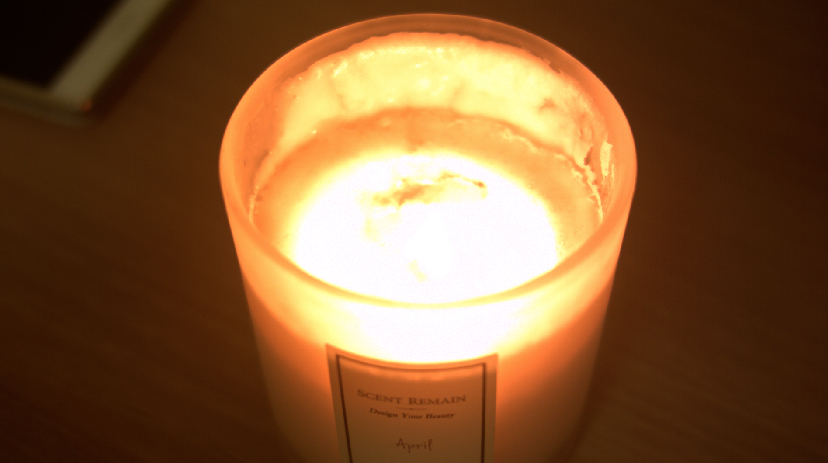

# Temperature

* 용암 이미지 입니다.
* 어디서 얻은지도 모르겠어요. 언젠가 색온도를 잘 표현할 수 있는 이미지를 촬영하게 된다면 라이센스 문제로 바꿀 예정입니다.
* 어디가 가장 뜨거운지 짐작이 가지 않습니까?
* 제가 찍어본 촛불입니다. ND필터가 집에 없습니다. 촛불 근처는 이미지가 밝게 탔지만 색온도가 잘 뭍어있습니다. 

  

* 촛불 플레이트 DNG 오리지털 데이터 : [https://drive.google.com/open?id=0B3O\_eJlmdgJVal94UExVWlpYZmM](https://drive.google.com/open?id=0B3O_eJlmdgJVal94UExVWlpYZmM)

* 초보자들은 색을 위 패턴처럼 사용하며, 고수들은 아래 형태처럼 사용해서 온도를 표현합니다.

* 조명역시 종류에 따라서 색온도가 다릅니다.

* 온도에 따른 색표현의 예 입니다.
* 많은 색온도가 담겨있으며, 가장뜨거운것은 파랑 -&gt; 흰색 -&gt; 노랑 -&gt; 빨강 순서로 바뀌는 것을 볼 수 있습니다.

## 참고자료

* 색온도 : [https://en.wikipedia.org/wiki/Color\_temperature](https://en.wikipedia.org/wiki/Color_temperature)
* ND필터 소개 동영상 : [https://www.youtube.com/watch?v=wk-Orfddpog](https://www.youtube.com/watch?v=wk-Orfddpog)

