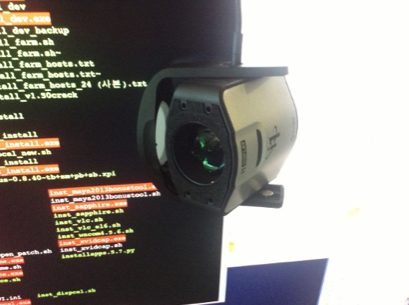
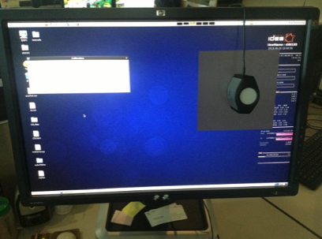
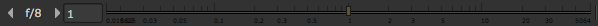

# Process

## 모니터 켈리브레이션

* 회사에서 사용하는 모니터 캘리브레이션 장비 사진입니다.
* 위와 같은 장비를 이용해서 먼저 모니터의 색상을 맞춥니다.

## 프리컴프

* 에러 체크 : 길이, 이미지 비트, 컬러스페이스를 체크합니다.
* 레이아웃, 퍼스펙티브 처럼 기본적인 그림의 형태를 먼저 잡습니다.
* 샷 분석 : 이미지의 픽셀들을 보며 어떤 특징들이 있는지 작업요소와 머릿속으로 연관지어 생각해 봅시다.
* 트레킹, 렌즈왜곡 체크 : 각 요소들이 어떤 형태로 움직임을 가지고 있는지 알면 트레킹시에 도움이 많이 됩니다.
* 3D 작업이 들어간다면 라이팅의 방향 및 조명의 방향을 예측해 둡니다. 현장에서 기록해둔 노트가 유용하겠습니다.
* 프리컴프 단계에서는 추후 문제가 없도록 기술이슈를 중점으로 이야기하며 레이아웃 등 큰 형태를 먼저 이야기 합니다.

## 로토스코핑, 리무브, 엣지디테일

* 보통 프리컴프가 잘 되면 이후 디테일 작업에 들어갑니다.
* 로토, 리무브, 합성작업들이 진행됩니다.
* 다른팀에서 넘어오는 소스상황을 체크합니다.
* 엣지 디벨럽은 미묘한 차이로 사실감의 차이가 생깁니다.

## 결과물 체크

* 색온도
* 노출점검 : 뷰어 상단에 있습니다. 노출이 바뀌어도 합성이 자연스러운지 체크합니다.

  

* 컬러스페이스 점검
* LUT점검
* 그레인점검
* 디포커스 점검
* 최대노출값 체크
* 환경과 반응하는 요소체크 : 리플렉션, 보조광, 움직이는 구름등.

## 아웃풋

* 이미지 사이즈를 점검해 봅시다.
* 컬러스페이스를 점검해 봅시다.
* FPS 점검합니다.
* 원본 메타데이터가 손실되지 않았는지 점검합니다.

