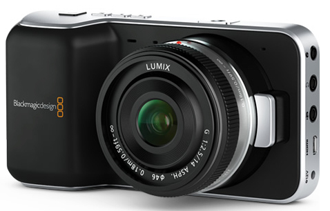
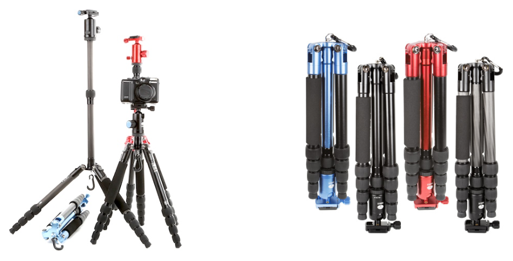

# Bmpcc

* 제가\(김한웅\) 2년 이상 사용하고 있는 기종입니다.
* 펌웨어를 통해서 꾸준히 SW 유지보수를 받고 있는 느낌이라서 괜찮게 사용하고 있습니다.
* 이 책에서 촬영되는 플레이트는 전부 이 카메라로 촬영되고 있습니다.
* 특별한 경우에만 DNG\(Raw\) Linear컬러스페이스로 촬영하고 일반적으로는 Log colorspace / Prores422HQ 로 촬영하고 있습니다.
* 다빈치 리졸브를 이용해서 작업할 수 있습니다. 다빈치 리졸브 라이트버전은 무료입니다.  [https://www.blackmagicdesign.com/kr/products/davinciresolve](https://www.blackmagicdesign.com/kr/products/davinciresolve)

## 기본정보

* 이 카메라는 2.88 크롭바디 특성이 있습니다.
* 20mm렌즈를 장착했을 때 20 \* 2.88 = 57.6mm 느낌으로 촬영됩니다. 렌즈 선택에 주의하세요.
* CCD 사이즈 : 12.48 x 7.02mm
* 렌즈디스토션 챠트 : [https://github.com/khw7096/bmpcc/blob/master/lensdist/lensdisto.jpg](https://github.com/khw7096/bmpcc/blob/master/lensdist/lensdisto.jpg)

## 트라이포드

* 안정적인 촬영에 트라이포드는 필수입니다.
* 저는 Sirui T05X 모델을 사용하고 있습니다.

