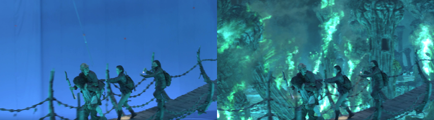

# Intro

## Nuke 소개

* 최초에 [디지털도메인](https://www.digitaldomain.com/)에서 개발된 합성툴입니다.
이후 [The Foundry](https://www.foundry.com/)사에서 뉴크가 관리 개발되고 있습니다.
* 광고, 영화 VFX 작업시 합성 작업의 표준툴로 많이 사용되고 있습니다.

## Natron 소개

* 오픈소스 합성툴입니다. 뉴크와 비슷하게 생겼습니다.
* 기능은 Nuke보다 떨어지지만 합성 이론을 배우기에는 이미 충분한 툴 입니다.
* 다운로드 사이트 : [http://natron.fr](http://natron.fr)

## Digital Compositing이란

* 다양한 시각적 효과를 위해 2개 혹은 그 이상의 이미지를 합치는 과정
* 여러 아티스트가 생성한 자료\(이미지,정보\)를 이용해서 아웃풋 이미지를 생성하는 과정

## 이 교육과정에서 요구하는 단계

* Rotoscoping : [http://vimeo.com/74499805](http://vimeo.com/74499805)
* Remove : [http://vimeo.com/104215491](http://vimeo.com/104215491)

## 핸드폰으로 영상을 촬영하고 합성툴을 이용해서 작업된 결과물

* 값비싼 카메라가 없어도 아티스트의 노력과 아이디어로도 충분히 다음과 같은 결과물을 제작할 수 있습니다.
* 참고자료1 : [https://www.youtube.com/user/ZachKingVine](https://www.youtube.com/user/ZachKingVine)
* 참고자료2 : [https://www.youtube.com/watch?v=C8O8W0RlCTc](https://www.youtube.com/watch?v=C8O8W0RlCTc)

