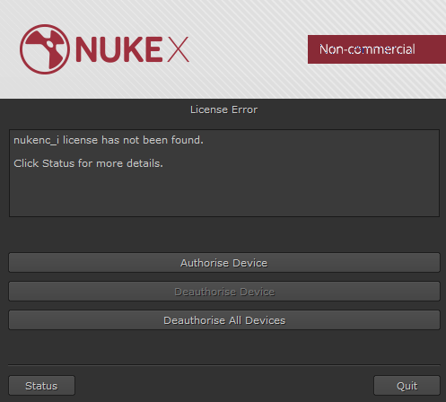

# Install\_nuke

## 소프트웨어 다운로드

* The Foundry 사이트에 가입하세요. [http://www.thefoundry.co.uk/](http://www.thefoundry.co.uk/)
* 로그인을 하고 뉴크를 다운로드 받습니다. [https://www.foundry.com/products/nuke/download](https://www.foundry.com/products/nuke/download)

## 설치 및 라이센스 인증.

* 다운로드 받은 설치 파일을 실행합니다.
* 윈도우즈를 사용한다면 내 컴퓨터의 사용자 이름이 한글인지 체크하세요. 사용자 이름이 한글이면 뉴크가 실행되지 않습니다.
* 주의 : 사용자 이름이 한글이었는데 영문으로 바꾸기만 한다고 사용자 폴더가 영문으로 바뀌지 않습니다. 새로운 사용자를 영문으로 만들어주세요.
* 윈도우즈10은 뉴크가 설치되지 않습니다.\(설치가능 OS 리스트\)
  * macOS
  * Windows 7, Windows 8 64비트
  * CentOS/RHEL 5 or CentOS/RHEL 6
* Non-Commercial 라이센스 인증은 1명이 2개의 기기에 2개의 라이센스를 받을 수 있습니다.
* 라이센스 발급시 오래걸릴 땐 약 5분정도 소요되는 경우도 있습니다.
* Non-Commercial 버젼은 1달마다 라이센스를 갱신해야합니다.
* Non-Commercial 버젼은 1920x1080 까지만 렌더링 걸 수 있습니다.
* 입사를 위한 포트폴리오는 1920x1080 사이즈로도 충분합니다.
* Non-Commercial 버젼은 플러그인 실행이 되지 않습니다. 프로그래밍 코드를 실행할 수 없습니다.
* 만약 플러그인이나 코드를 실행하고 싶다면 Trial 버젼을 설치하세요. 15일간 사용해볼 수 있습니다.
* 파일이 저장되는 확장자는 .nknc 입니다. 비상업용이라서 파일자체가 .nk와 다르게 암호화 되어있습니다.
* 윈도우즈라면 퀵타임을 설치해주세요. 간혹 mp4같은 파일이 열리지 않을 수 있습니다.
* 퀵타임 다운로드 링크 : [https://support.apple.com/kb/DL837?locale=ko\_KR](https://support.apple.com/kb/DL837?locale=ko_KR)

## 자신의 다른 컴퓨터에도 라이센스를 설치하려면..

* 뉴크 Non commercial 라이센스를 발급받고 다른 장비도 사용하려면 추가 장비를 등록해야합니다.

  

* 위와 같은 창이 뜨며 Authorise Device를 선택해서 장비를 추가 등록합니다.
* 만약 장비가 3개가 넘으면, Deauthorise All Devices를 눌러서 이미 등록된 컴퓨터를 제거해주세요.

## 실행에 에러가 난다면..

* 간혹 Non-Commercial 버젼이 실행되지 않는다면 Foundry 홈페이지에 로그인하고 등록된 장비인 체크해보세요.

