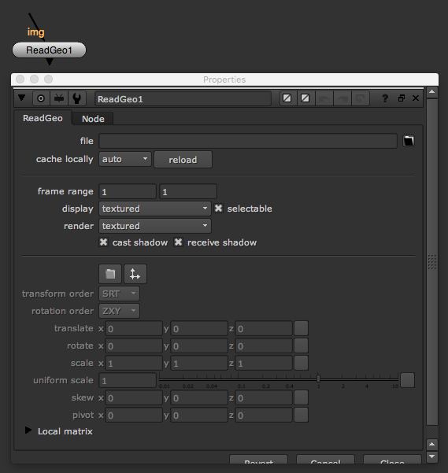

# ReadGeo\_node

* 2.5D 작업시 많이 사용됩니다.
* 3D 오브젝트를 뉴크로 불러올 때 사용합니다.
* 지원되는 오브젝트
  * obj
  * abc
  * fbx

## 예제파일

* 원숭이 얼굴 모양의 obj파일을 예제파일로 링크합니다. blender라고 하는 오픈소스 3D툴에서 데이터를 뽑았습니다.
* 예제 obj파일 : [https://drive.google.com/open?id=0B3O\_eJlmdgJVQ3Q3ZmNpZk1ra0k](https://drive.google.com/open?id=0B3O_eJlmdgJVQ3Q3ZmNpZk1ra0k)

