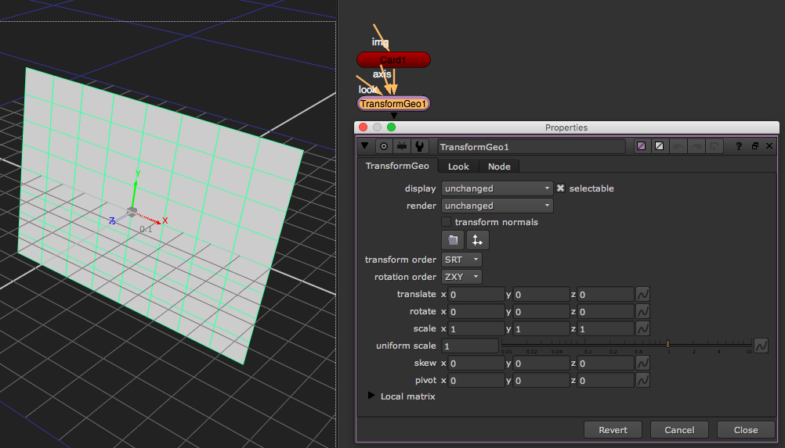

# TransformGeo\_node

* 3D 물체의 위치,회전, 스케일을 조절할 때 사용합니다.
* Card, 3D Object, Camera 등의 오브젝트에 연결해서 사용합니다.
* 2.5D 합성시 자주 사용합니다.

## 2.5D란?

* 영상으로 느껴봅시다. : [https://vimeo.com/103845263](https://vimeo.com/103845263)

