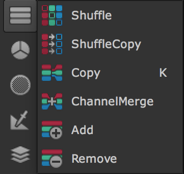

# Channel

* 이미지의 채널을 추가,수정,합치기,삭제하기 위한 노들로 구성되어 있습니다.

## 채널이란

* 뉴크는 이미지에 R,G,B,A 값 이외에도 여러가지 이미지 정보를 저장할 수 있습니다.
* R,G,B,A 를 포함해서 다른 영역에 값이 저장된 것들을 채널이라고 합니다.
* 뉴크는 1개의 이미지에 최대 1023개의 채널을 저장할 수 있습니다.

## natron

