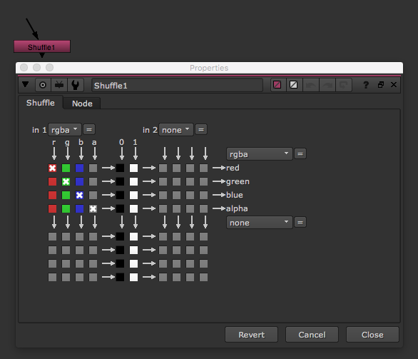
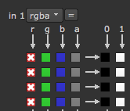
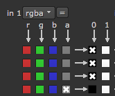
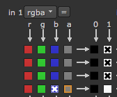

# Shuffle\_node

* 이미지에 저장되어있는 채널정보를 수정하고 싶을 때 사용합니다.
* 사용 예
  * 예로 R채널을 다른 채널로 복사하고 싶을 때.
  * 특수 채널을 RGBA 역영으로 빼고 싶을 때.
  * 특정 채널 자체를 흰색 또는 검정으로 바꾸고 싶을 때.

## 예 제

* 모든채널을 R채널로 바꿀 때

  

* RGB 채널을 블랙으로 만들고 A채널만 남길 때

  

* RGB채널을 흰색으로 바꾸고 A채널을 B채널로 설정할 때

  

