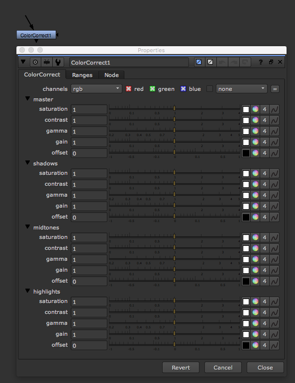
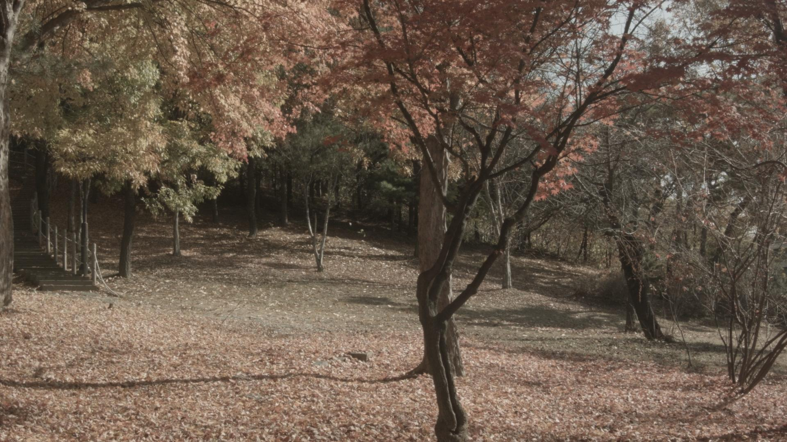
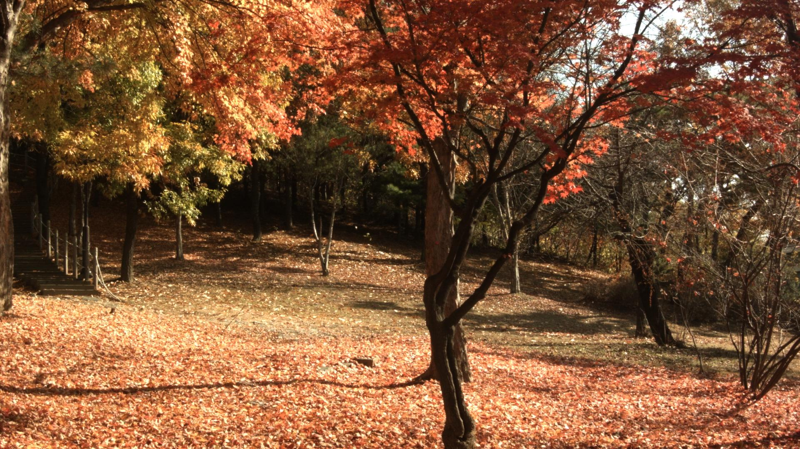

# ColorCorrect\_node

* 이미지의 색을 변경할 때 사용합니다.
* 단축키 C로 되어있습니다.
* 3D 개념의 컬러를 수정하는 노드입니다.
  * low, middle, high 톤의 개별 수정.
  * 각 톤에서 saturation, contrast, gamma, gain, offset
* 컬러 휠이 작아서 불편할 때는 설정을 바꾸어보세요.
  * Preferences &gt; Control panels &gt; Color Panel &gt; floating color picker 선택

## 예제파일

* 단풍나무입니다. 아침산책으로 윤지은 촬영감독님이 촬영해주었어요.
* [https://drive.google.com/open?id=0B3O\_eJlmdgJVZWVaYkQ1ZDY5MUE](https://drive.google.com/open?id=0B3O_eJlmdgJVZWVaYkQ1ZDY5MUE)
* 원본 log형태의 색상입니다. 흐리흐리 합니다.

  

* 제가 돌려본 실제 색상입니다. 여러분도 한번 다운로드 받아서 색을 돌려보세요.

  

