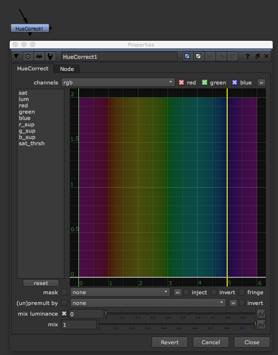

# HueCorrect\_node

* Hue 영역만 색상을 조절할 때 사용하는 노드입니다.
* 일반적으로 despill 작업시 많이 사용합니다.
* 그린 스크린이나 블루 스크린에서 촬영된 이미지는 엣지나 피사체에 스크린의 색이 많이 묻습니다.
* 위 에서 묻은 색을 세밀하게 제거하는 작업을 Despill이라고 합니다.
* Despill 과정중에 픽셀의 정보가 많이 파괴되기 때문에 파괴되지 않는 스필작업은 픽셀을 관찰하며 세밀하게 작업해야합니다.
* 프로젝트, 카메라에 따라서 Despill 작업이 다르며, 필요에 따라서 Despill작업을 돕는 노드도 많이 사용됩니다.

## 각 영역

* sat : 채도를 조절합니다.
* lum : 밝기를 조절합니다.
* red : Red값을 조절합니다.
* green : Green값을 조절합니다.
* blue : Blue값을 조절합니다.
* r\_sup : Red 스필값을 조절합니다.
* g\_sup : Green 스필값을 조절합니다.
* b\_sup : Blue 스필값을 조절합니다.
* sat\_thrsh : 요거 잘 모르겠네요. 아시는분 있다면 메일주세요. 뉴크메뉴얼에도 없어요. ㅋㅋ

## 테스트하기 좋은 플레이트

* [https://drive.google.com/open?id=0B3O\_eJlmdgJVNWRVUjNiQzVWNWs](https://drive.google.com/open?id=0B3O_eJlmdgJVNWRVUjNiQzVWNWs)

## 플러그인

* despillmadness : [http://www.nukepedia.com/gizmos/keyer/despillmadness](http://www.nukepedia.com/gizmos/keyer/despillmadness)

