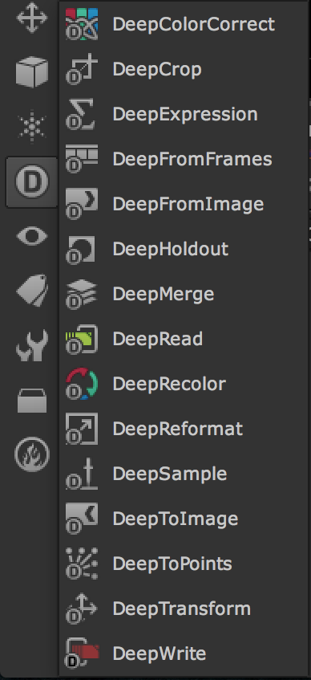

# Deep

* 뉴크에서 Deep 이미지를 합성하기 위해서 사용합니다.
* 요즘 렌더러들은 EXR에 이미지를 저장할 때 Deep형태로 저장 렌더링하는 것을 지원합니다.
* 데이터가 무거워서 꼭 필요한 샷만 Deep작업을 하게 됩니다.
* 무겁기 때문에 Deep을 따로 렌더링해서 사용하는 경우가 많습니다.

## DeepImage를 사용하는 이유
* 렌더링을 할 때 요소를 거리별 또는 레이어별로 구분해서 렌더링 하지 않아도 됩니다.(프로세스가 단순해 집니다.)
* 위 상황은 수많은 팀이 파이프라인에 물려있을 때 더욱 가치가 높아집니다.
* 픽셀에 카메라부터의 거리정보가 포함되어 있습니다. 2.5D합성시 기본정보로도 활용할 수 있습니다.
* 수많은 장점이 있지만 생각나면 더 적겠습니다.

## 관련링크

* Deep : [http://youtu.be/19w3vkFp5X0](http://youtu.be/19w3vkFp5X0)

