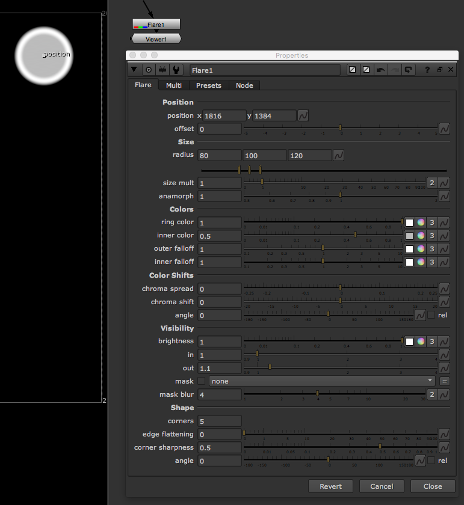

# Flare\_node

* 간단한 렌즈플레어를 생성합니다.
* 위 소스들을 중첩, 모양을 바꾸어서 리얼한 플레어를 수동으로 만듭니다.
* 일반적으로는 플러그인을 사용하는 것이 더 효율적인 경우가 많습니다.
* 실제 플레어 이미지 입니다.

## 관련된 플러그인

* Opticalflares : [https://www.videocopilot.net/products/opticalflares/](https://www.videocopilot.net/products/opticalflares/)

