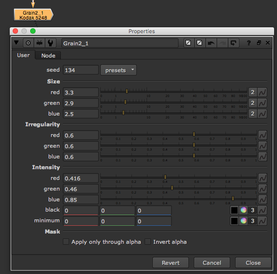

# Grain\_node

* 이미지에 그레인을 넣을 때 사용하는 노드입니다.
* 그레인은 R,G,B 채널을 각각 따로따로 보며 합성해야 합니다.
  * Size : 그레인의 크기를 설정합니다.
  * Irregularity : 렌덤함\(변칙성\)을 설정합니다.
  * Intensity : 그레인의 세기 / 적용되는 블랙레벨 수치를 설정합니다.

## 연관된 플러그인

* f\_regrain 노드도 같은 역할을 하며 이미지의 그레인 샘플영역을 설정하고 자동으로 그레인을 연산할 수 있습니다.

