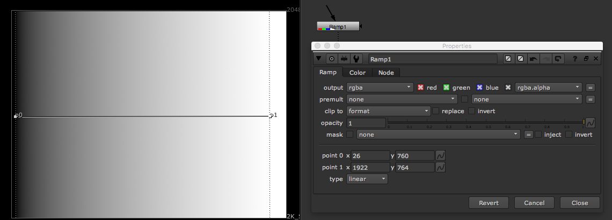
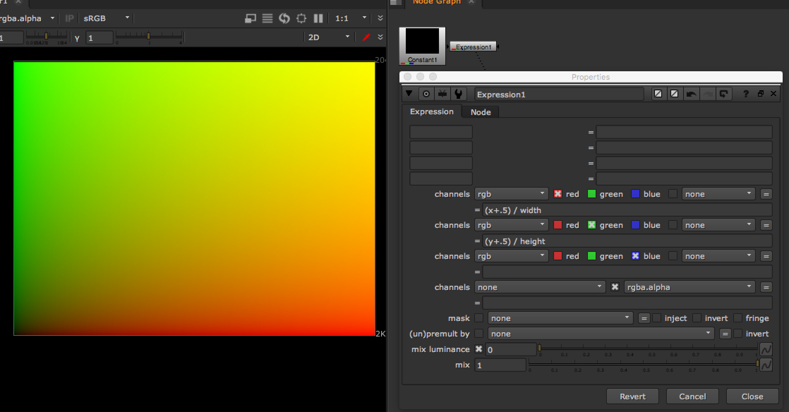

# Ramp\_node



* 그라데이션 이미지, 마스크를 만들 때 사용합니다.
* 응용에 따라서 많은 것들을 할 수 있습니다.
  * 하늘에 그라데이션 주기.
  * 거리별로 색의 차이를 주기 위해서 사용합니다.
  * 광범위의 스펙큘러등을 생성할 때 사용합니다.
  * 수많은 곳에 응용할 수 있습니다.

## 익스프레션의 활용.

* 보통 UV이미지나 LUT 타일이 아래 형태의 익스프레션으로 구성되어 있습니다.

  ```text
  r = (x+.5) / width
  g = (y+.5) / height
  ```

  

