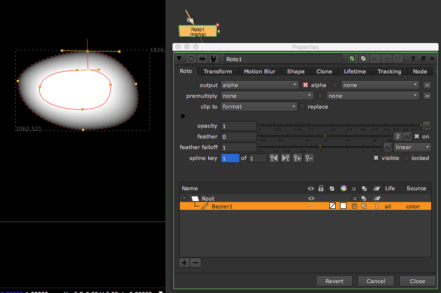
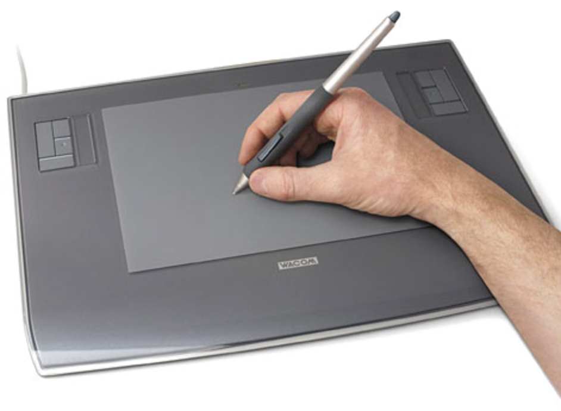
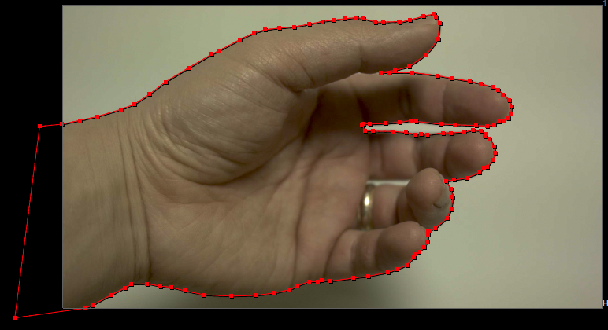
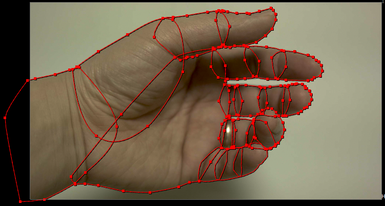

# Roto\_node

* 로토스코핑을 하기 위한 노드입니다.
* 합성 노드 사용률 순위로 당당히 통계에서 1등을 차지 했네요.
* 통계를 내기 전까지는 정말 1등을 할지는 몰랐습니다.
* 로토스코핑은 마우스로 오랫동안 작업하면 손목이 많이 아픕니다.
* 많은 아티스트들이 로토 스코핑 작업을 위해서 타블렛을 사용합니다.\(처음 접할때는 마우스보다 불편합니다.\)

  

* 처음 합성을 시작할 때 많이 연습해 두어야 하는 노드이기도 합니다.
* 자신이 컨트롤 하고 싶은 영역을 만들어내지 못한다는 것은 컴포지터에게 치명적일 수 있습니다.

## 로토스코핑 방법

* 고정물체는 1프레임을 잡고 이동, 키를 생성해서 로토를 수정한다.
* 유기체, 관절체는 각 관절마다 로토를 만든다.
* 잘못된 방법 : 보이는데로 로토를 하면 점이 많아지고 놓치는 영역이 발생하고 무거워집니다. 협동되지 못합니다.

  

* 올바른 방법 : 에니메이션이 되도록 관절별로 작업합니다. 서로 나누어서 협동 작업이 가능합니다.

  

* 플레이트 : [https://drive.google.com/open?id=0B3O\_eJlmdgJVbVcwNDlOdFBYTlU](https://drive.google.com/open?id=0B3O_eJlmdgJVbVcwNDlOdFBYTlU)

## 관련 소프트웨어

* 이미지를 분석해서 어느정도 트레킹, 로토스코핑 해주는 모카라는 툴도 있습니다. 뉴크로 로토정보를 보낼 수 있습니다.
* mocha : [http://www.imagineersystems.com](http://www.imagineersystems.com)

