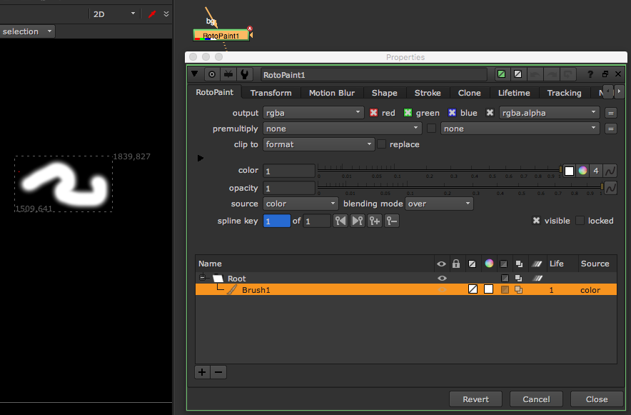

# RotoPaint\_node

* 로토를 할 때 이 노드를 사용해도 되지만 사용하지 않습니다.\(무겁기 때문이며, 많은 페인팅이 누적된 노드는 자주 뉴크를 다운시킵니다.\)
* 정말 페인팅 작업시에만 사용합니다.
* 페인팅 1번이 Brush 하나씩 생성됩니다.
* 보통 Clone기능을 통해서 옆에 있는 픽셀을 복제해서 페인팅하는 방법을 가장 많이 사용합니다.
  * 그린스크린\(또는 블루스크린\) 마커 지우기
  * 리플렉션 지우기
  * 와이어 지우기
  * 등등에 사용합니다.

## 단축키

* Shift + 마우스 왼쪽 버튼 : 브러시 사이즈
* Ctrl + 마우스 왼쪽 버튼 : 복사영역 설정

## 예제파일

* 마커가 찍힌 영상 : [https://drive.google.com/file/d/0B3O\_eJlmdgJVNWRVUjNiQzVWNWs/view?usp=sharing](https://drive.google.com/file/d/0B3O_eJlmdgJVNWRVUjNiQzVWNWs/view?usp=sharing)

