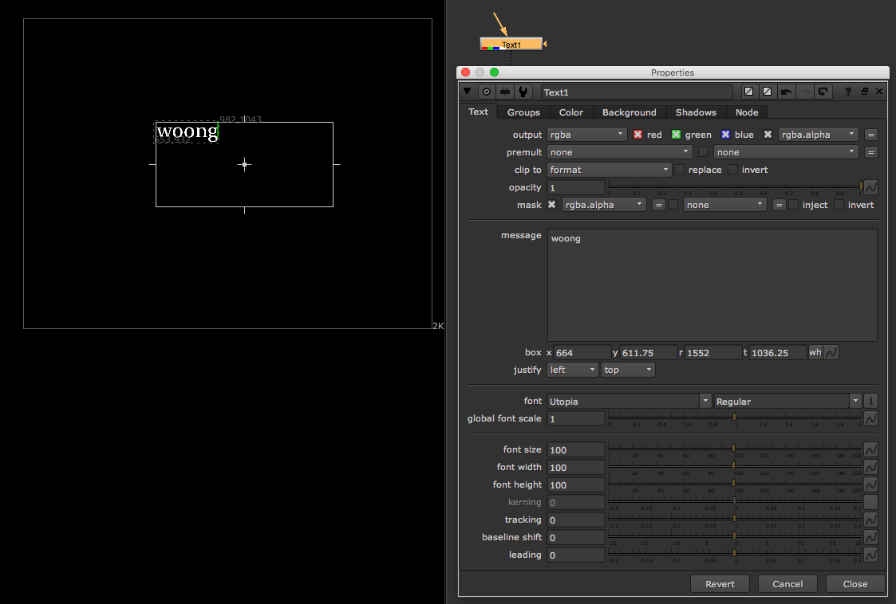

# Text\_node



* Text를 작성합니다.
* 다른 font 파일이 있는 경로를 활용해야 할 때는 아래 환경변수를 뉴크에서 잡아주어야 합니다.

  ```text
  NUKE_FONT_PATH
  ```

## 익스프레션의 활용\(Burn-in\)

* 프레임 표기 : `[frame]`
* 자릿수 프레임 표기 : `[format %04d [frame]]`
* 특정 노드의 값 출력 : `[value Grade1.gamma]`
* 파일 경로 가지고 오기 : `[value Read1.file]`
* 뉴크 파일 출력 : `[file tail [knob root.name]]`
* 뉴크 파일경로 출력 : `[lrange [split [file dirname [knob root.name]] "/"] 0 end-1]`
* 위 결과에 "/" 문자 붙히기 : `[join [lrange [split [file dirname [knob root.name]] "/"] 0 end-1] "/"]`

