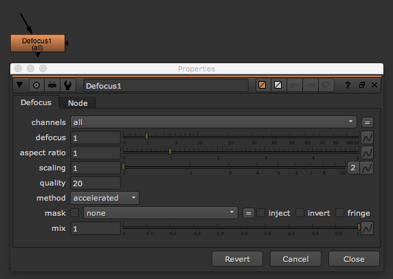

# Defocus\_node

* 이미지를 포커스 아웃되게 만들 때 사용합니다.
* 아래 예제파일을 다운 받아서 실사에서 일어나는 포커스를 관찰해봅시다.
* 디지털로 Defocus를 주었을 때 실제로 CG와 실사를 비교해봅시다.

## 예제파일 / prores / log

* 포커스가 맞은 실사 플레이트 : [https://drive.google.com/open?id=0B3O\_eJlmdgJVWk92T3RmenFnQWs](https://drive.google.com/open?id=0B3O_eJlmdgJVWk92T3RmenFnQWs)
* 포커스 아웃된 실사 플레이트 : [https://drive.google.com/open?id=0B3O\_eJlmdgJVd3JudEIxekM0NjQ](https://drive.google.com/open?id=0B3O_eJlmdgJVd3JudEIxekM0NjQ)

