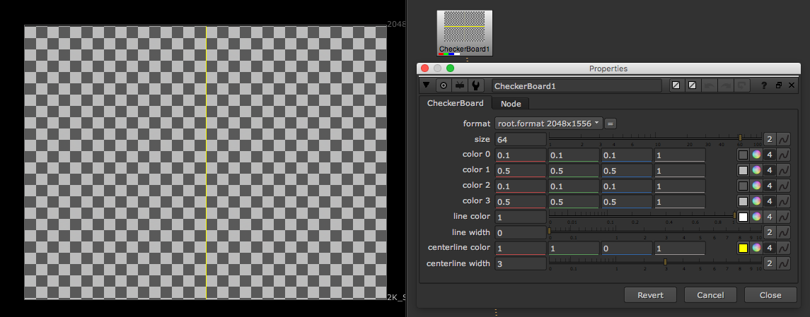
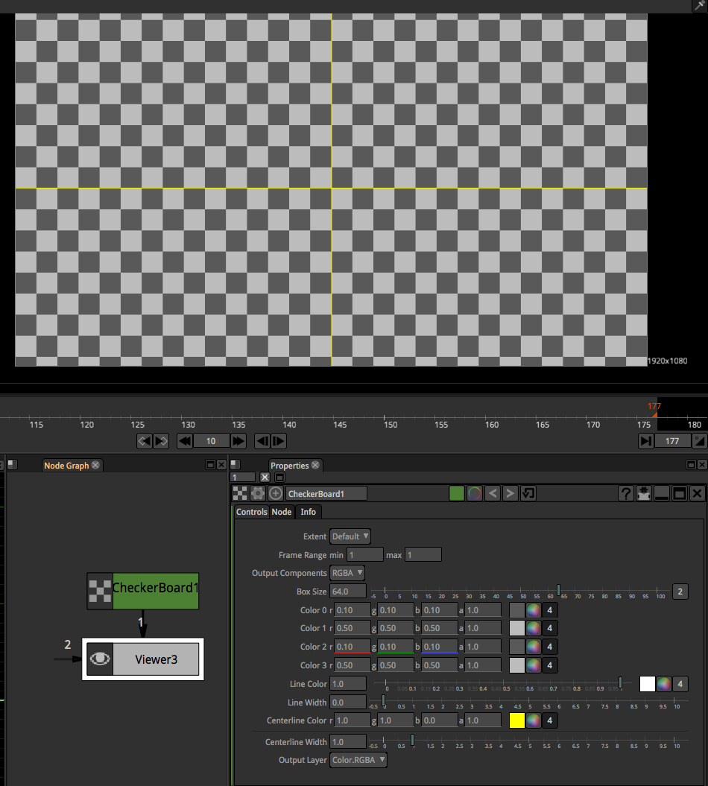

# CheckerBoard\_node

## Nuke

* 체커보드 이미지를 생성합니다. 다용도로 활용됩니다.
* 트레킹이 밀리는지 테스트 하기 위해서 간단하게 이미지를 넣어볼 때 많이 사용합니다.
* 위 상황과 연관되어 3D환경에서 Card에 맵핑해서 트레킹이 잘 맞아보이는지 테스트시에도 사용됩니다.
* 3D 오브젝트를 뉴크에서 불러와서 UV를 체크할 때도 많이 사용합니다.

## Natron

