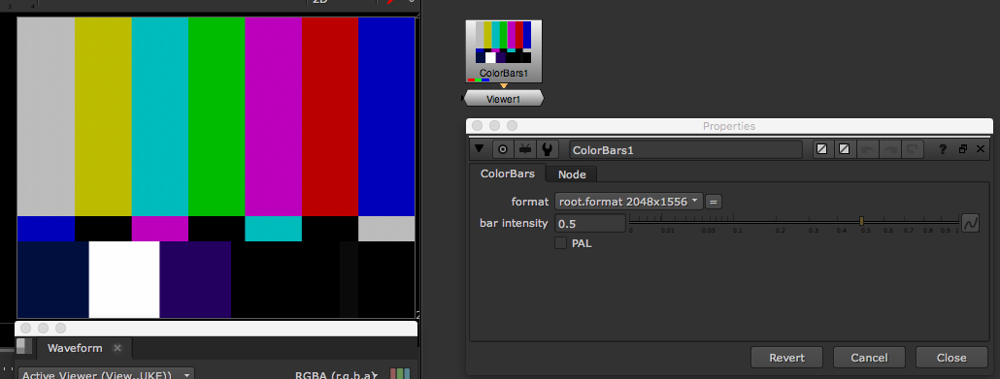
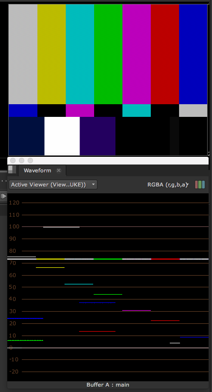
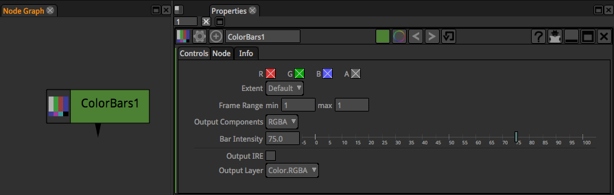

# ColorBars\_node

* 컬러바 노드입니다. 간혹 옛날 TV에서 많이 보이던 이미지 입니다.
* 웨이브폼의 수치 체크 이미지로 많이 활용됩니다.

## 자세히

* 웨이브폼과 같이 보면, 하단의 2두번째 흰색은 Waveform에서 100% 라인에 있는 흰색이라는 것을 알 수있습니다.
* 컬러표와 웨이브폼을 보면 블랙도 실제로는 5% 블랙이구요, 나머지 색도 Waveform 레벨의 의미가 있습니다.
* 뉴크에서 나간 컬러가 다른 I/O장비를 거쳐서 다른 방송용 모니터나 다른 장비로 컬러신호가 보내질 때, 알수 없는 에러가 있는지 체크하기 위해서 많이 사용합니다. 뉴크에서 정상 신호가 출력되고 최종 아웃풋 장비의 Waveform이 정상이라면, 색 데이터가 선을 통해서 잘 전달되었다고 볼 수 있죠.

## 기타 참고문서

* [http://www.al-mousawi.org/TV\_Production/postprod.html](http://www.al-mousawi.org/TV_Production/postprod.html)

## Natron

* 뉴크와 같다.

  

