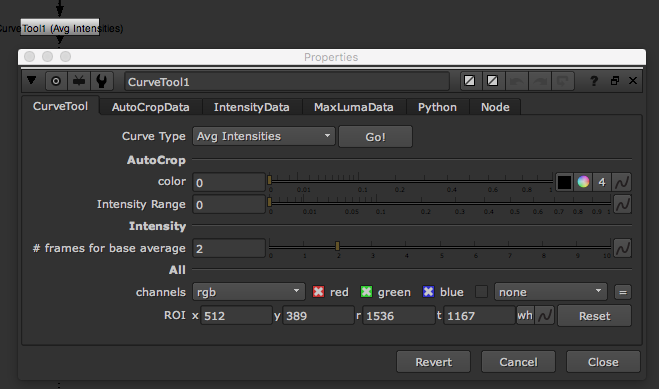

# CurveTool\_node

## Nuke

* 노드의 장르로 따지자면 이미지 분석툴입니다.
* 이미지를 분석해서 그래프로 만들 때 사용합니다.
* 다음과 같은 역할을 할 수 있습니다.
  * Auto Crop : 자동크롭, Alpha를 가진 EXR의 연산을 가볍게 하기 위해서, 연산에 필요한 영역만 BBox를 생성할 때 사용합니다.
  * Avg Intensities : 평균 픽셀의 밝기 그래프를 그려줍니다.
  * Exposure Difference : 노출차이에 대해서 그래프를 그려줍니다.
  * Max luma Pixel : 가장 밝은 픽셀을 찾고, 밝기 그래프를 그려줍니다.

## Natron

* 비슷한 노드가 존재하지 않습니다.

