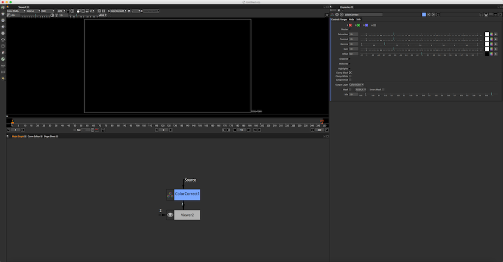

# Interface

## 인터페이스를 훑어봅시다.

* 메뉴바 : 최상단에 위치한 메뉴입니다.
* 툴바 : 왼쪽에 긴 막대형태의 아이콘 모음입니다.
* 뷰어 : 까만색의 영역. Tab을 누르면 3D환경으로 바뀝니다.
* 노드뷰 : 하단의 각 노드를 생성, 연결, 관리를 하는 영역입니다.
* 파라미터창 : 오른쪽, 노드의 옵션을 조절할 수 있는 창입니다.
* 기타 창들은 교육을 통해서 배워보겠습니다.

## Natron

* 뉴크와 비슷하게 생겼네요.

  

