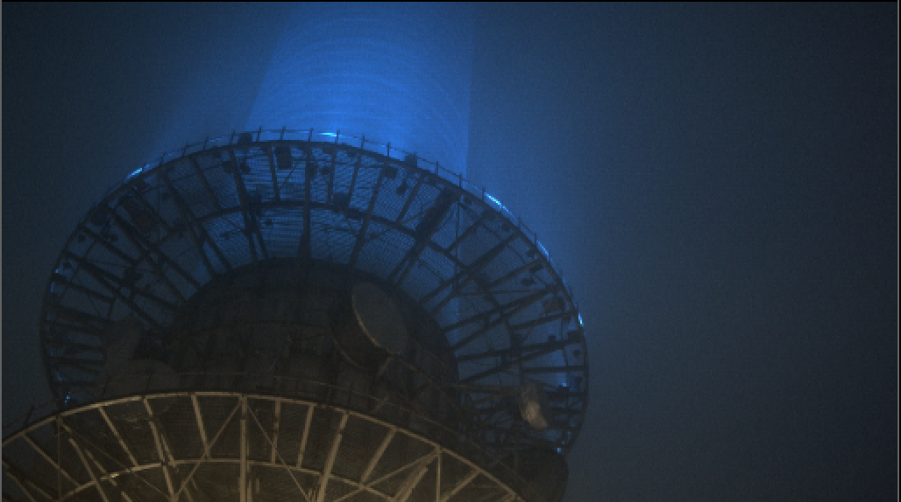

# Histogram

* 남산에서 찍었던 타워이미지 입니다. 

  

* Histogram은 아래 위치에서 찾아볼 수 있습니다. 

  

* 히스토그램 입니다.

* 픽셀의 밝기에 따른 분포도를 보여줍니다.
* 이미지 분석시, 촬영시에도 사용됩니다.
* 너무 그래프가 왼쪽에 치우쳐져 있다면 어두운 이미지, 오른쪽에 치우쳐져 있다면 밝은 이미지 입니다.
* 전체적으로 조명이 부족하다면 픽셀들이 바닥을 기어 다닙니다.
* 너무 밝을 땐 Clamp 영역 밖으로 픽셀들이 튀어 나갑니다.

## 예제파일

* [https://drive.google.com/open?id=0B3O\_eJlmdgJVUF84anlreXZELVU](https://drive.google.com/open?id=0B3O_eJlmdgJVUF84anlreXZELVU)

## Natron

* 레이아웃버튼에서 New histogram을 찾습니다.

  

* 뉴크와 비슷하게 분석할 수 있습니다.

  

