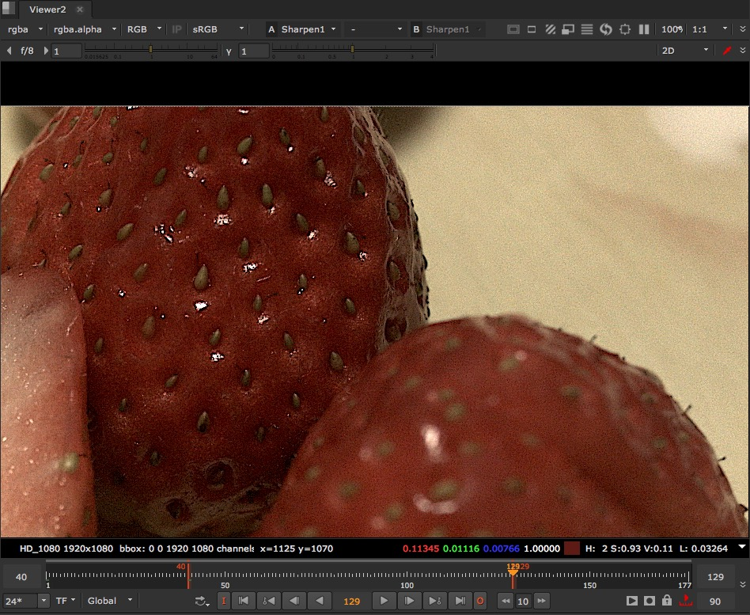
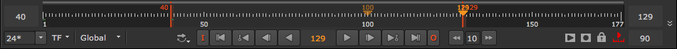
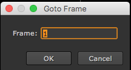

# Interface\_Viewer

* View에서 자주 사용하는 기능들을 살펴봅시다. 뷰어는 아래처러 생겼습니다. 

  

* 뷰어의 하단 타임라인에서 i키와 o키를 누르면 In Out을 설정하고 작업할 수 있습니다. 

  

* Alt + G를 누르고 원하는 프레임을 입력하면 그 프레임으로 이동합니다.

  

## 마우스 & 단축키

* 마우스 휠 : 이미지 확대 / 축소
* 마우스 가운데 버튼 : 이미지의 이동
* f : 이미지를 뷰어에 맞도록 채움.
* Ctrl + 1 : 1:1 사이즈로 이미지 보기.
* r : Red 채널보기 \(2번 누르면 원래대로 돌아옴\)
* g : Green 채널보기 \(2번 누르면 원래대로 돌아옴\)
* b : Blue 채널보기 \(2번 누르면 원래대로 돌아옴\)
* 1~0 : 각 숫자버튼에 설정된 뷰어 이미지 보기
* Tab : 3D뷰어로 전환. 다시 누르면 2D뷰어올 전환.
* q : 조절자들을 숨기기. 다시 누르면 보입니다.

## Natron

* In :Ctrl + Alt + i
* Out : Ctrl + Alt + o
* 프레임이동 : 뷰어에서 Tab

