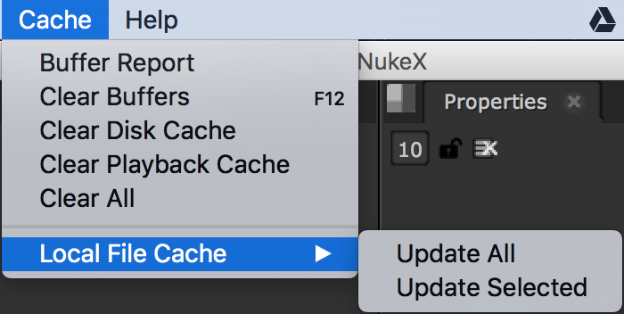

# Cache

* 뉴크가 연산시 컴퓨터에서 사용했던 자원을 다시 시스템으로 되돌리는데 목적이 있는 메뉴입니다.
* Buffer Report : 메모리 사용에 대한 보고서를 보여줍니다.
* Clear Buffers : 메모리 버퍼를 비웁니다.
* Clear Disk Cache : 디스크 캐쉬를 비웁니다.
* Clear Playback Cache : 영상재생을 하기위해서 사용했던 디스크 캐쉬를 비웁니다.
* Clear All : 위 메모리, 디스크캐쉬를 한번에 비웁니다.
* Local File Cache
  * Update All
  * Update Selected

## Natron

* 비슷한 구성으로 되어있습니다.

