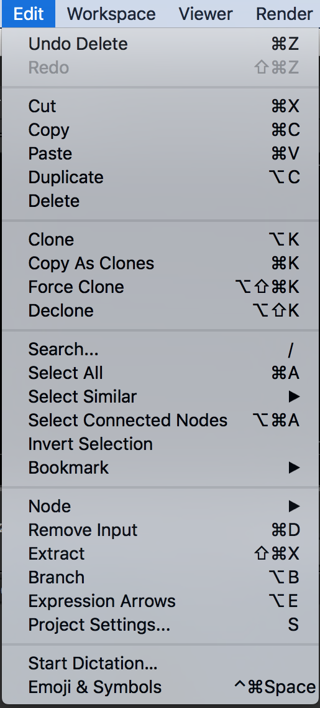

# Edit

## 대부분의 Edit 메뉴는 노드를 컨트롤 하기 위한 메뉴입니다.

* 아래 많은 기능이 있지만 실제 작업에서는 노드뷰어에서 단축키를 이용해서 많이 처리하게 됩니다.

* Undo : 전 작업 취소
* Redo : 취소한 작업으로 다시 돌아가기.
* Cut : 선택 아이템 잘라내기.
* Copy : 선택 아이템 카피
* Paste : 선택 아이템 붙히기
* Duplicate : 노드를 복제 합니다.
* Delete : 노드를 삭제합니다.
* Clone : 노드를 클론 합니다.\(노드가 복제되며 하나가 수정되면 다른 노드도 수정됩니다.\)
* Copy As Clones : 
* Force Clone : 같은 노드를 선택하고 강제로 클론으로 만듭니다.
* Declone : 클론을 해제합니다.
* Search... : 노드명으로 검색, 노드 안의 파라미터 검색시 많이 사용합니다.
* Select All : 전체 노드를 선택합니다.
* Select Similar : 컬러, Class\(노드종류\), Label 이 같은것을 선택할 때 사용합니다.
* Select Connected Nodes : 연결된 노드는 전부 선택합니다.
* Invert Selection : 선택노드를 제외한 나머지 노드를 선택합니다.
* Bookmark : 노드그래프의 위치를 단축키로 저장해서 왔다 갔다 할때 사용합니다.
* Node : 노드 관련된 메뉴가 있습니다.
* Remove Input : 인풋노드의 연결을 전부 끊습니다.
* Extract : 그룹을 풀때 사용합니다.
* Branch : 
* Expression Arrows : 익스프레션이 연결된 관계를 보여주는 라인을 그리거나 그리지 않습니다.
* Preferences : OS마다 다른곳에 위치합니다. 뉴크를 셋팅합니다.
* Project Settings... : 프로젝트를 셋팅합니다.

### Natron

* 위 항목보다 메뉴가 적습니다.

