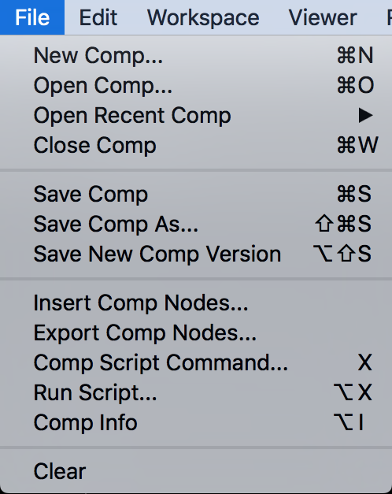

# File



* New Comp : 새로운 nk파일을 생성합니다.
* Open Comp : nk파일을 불러옵니다.
* Open Recent Comp : 최근 nk파일 리스트를 봅니다.
* Close Comp : 현재 합성파일을 닫습니다.
* Save Comp : 파일을 저장합니다.
* Save Comp As... : 파일을 다른 이름으로 저장합니다.
* Save New Comp Version : 뉴크파일의 뒷부분 이름이 숫자로 되어있다면 숫자를 자동으로 올려서 저장합니다.

```text
SS_0010_comp_v01.nk // Save New Comp Version 클릭시 아래 이름으로 바뀜
SS_0010_comp_v02.nk
```

* Insert Comp Nodes... : 다른 nk파일의 노드를 현재 파일로 불러옵니다.
* Export Comp Nodes... : 선택한 노드를 nk파일로 저장합니다.
* Comp Script Command... : TCL, Python 코드를 실행합니다.
* Run Script... : TCL, Python, nk 스크립트를 실행합니다.
* Comp Info : 현재 nk파일 정보를 보여줍니다.
* Clear : 뷰어와 노드를 깨끗하게 초기화 합니다.

## Natron

* 위 항목과 구성이 비슷합니다.
* 기능은 뉴크보다 적습니다.

