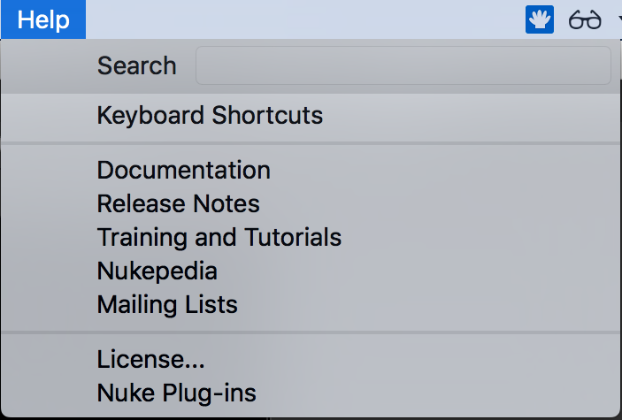
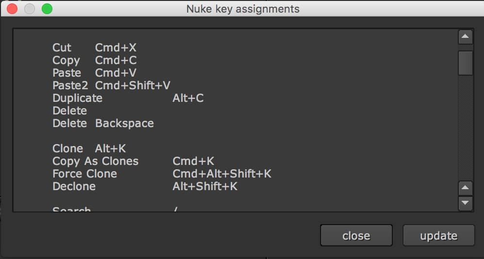
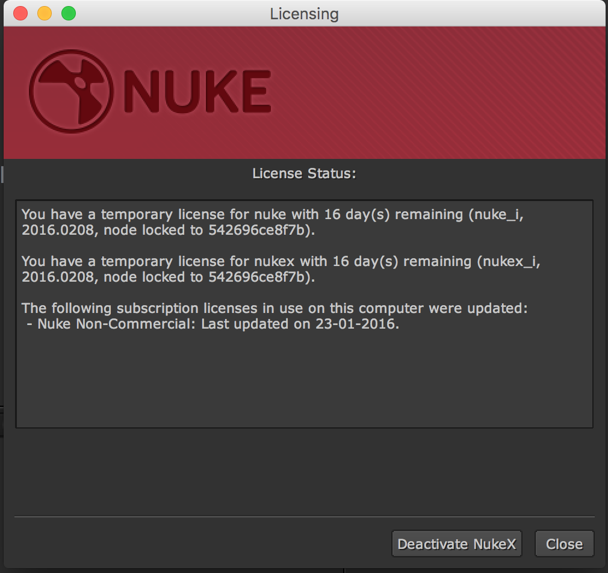

# Help

* Search : 도움말을 키워드로 검색할 때 사용합니다.
* Keyboard Shortcuts : 단축키를 텍스트로 볼 수 있습니다.

* Documentation : 뉴크 설치시 같이 설치되는 문서를 띄웁니다. 유용합니다.
* Release Notes
  * 각 버젼별 개발 수정사항을 볼 수 있는 페이지로 이동합니다.
  * [http://www.thefoundry.co.uk/products/nuke/release-notes/](http://www.thefoundry.co.uk/products/nuke/release-notes/)
* Training and Tutorials
  * 뉴크 트레이닝 사이트로 이동합니다.
  * [http://www.thefoundry.co.uk/products/nuke/learn1/](http://www.thefoundry.co.uk/products/nuke/learn1/)
* Nukepedia
  * 뉴크 플러그인이나 기즈모를 다운받을 수 있는 Nukepedia로 이동합니다.
  * 가입해두면 유용합니다. [http://www.nukepedia.com](http://www.nukepedia.com)
* Mailing Lists
  * Foundry 제품별로 기술, 이슈관련 메일을 데일리로 받아볼 수 있습니다.
  * [http://support.thefoundry.co.uk/cgi-bin/mailman/listinfo](http://support.thefoundry.co.uk/cgi-bin/mailman/listinfo)
* License : 자신이 사용중인 라이센스를 볼 수 있습니다. 저는 논커머셜, 트라이얼을 쓰고 있습니다. 

  

* Nuke Plug-ins
  * 뉴크에서 사용가능한 플러그인 리스트를 소개하는 웹사이트로 이동합니다.
  * [http://www.thefoundry.co.uk/products/nuke/nuke-plugins/](http://www.thefoundry.co.uk/products/nuke/nuke-plugins/)

