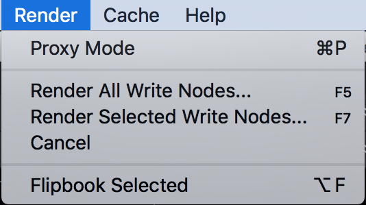
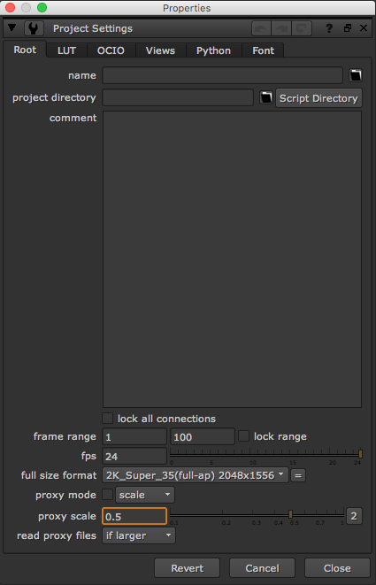
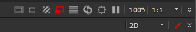
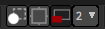

# Render

* 뉴크에서 렌더링을 위한 메뉴들이 모여있습니다.
* Proxy Mode : 프록시 모드를 켜고 끕니다.
* Render All Write Nodes : 전체 Write노드를 렌더링 합니다.
* Render Selected Write Nodes : 선택한 Write노드만 렌더링 합니다.
* Cancel : 렌더링중이면 렌더링을 취소합니다.
* Flipbook Selected : Read, Write노드를 선택후 실행하면 간단한 플레이창을 띄워서 볼 수 있습니다.

## Proxy 모드란?

* 가로 해상도 4K 이미지가 있다고 상상해 봅시다.
* 렌더링하게 되면 무척 무거울 것 입니다.
* 사실 합성 확인은 2K로 해도 문제가 없다고 판단이 되면 Proxy 모드를 켜서 작업하는것이 좋습니다.
* Proxy모드를 켜고 0.5값을 입력하면, 실제 연산은 4K \* 0.5 = 2K 형태로 보간 연산하게 됩니다.
* 연산 속도가 빨라지고 가벼워집니다.
* 프로젝트의 프록시 셋팅하는 곳은 아래와 같습니다. 노드뷰에서 s키를 눌러서 프로젝트 셋팅을 열고 Proxy Scale을 확인합니다.

  

* 뷰어에서 아래 이미의 빨간색으로 표시된 아이콘을 누르면 프록시 모드로 작동됩니다.

  

## Natron

* 프록시 모드의 아이콘이 비슷합니다.

  

