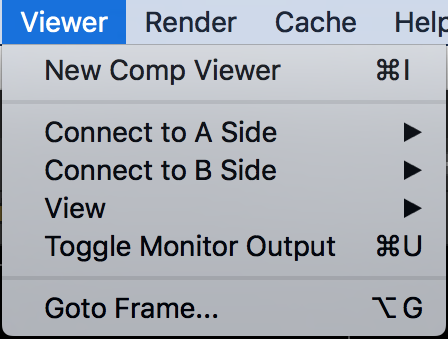
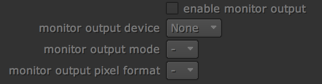

# Viewer

* New Comp Viewer : 새로운 뷰어를 추가합니다.
* Connect to A Side : A,B 이미지 비교시 A 버퍼에 등록할 이미지 설정.
* Connect to B Side : A,B 이미지 비교시 B 버퍼에 등록할 이미지 설정.
* View : 다음뷰와 전 뷰를 이동합니다.
* Toggle Monitor Output : 외부 모니터 연결시 신호를 보냅니다.
  * viewer에서 s 키를 누르면 설정창이 나옵니다. 하단에서 외부 장치와 연결할 수 있습니다
  * 예:블랙매징장비 : [https://www.blackmagicdesign.com/products/ultrastudiothunderbolt](https://www.blackmagicdesign.com/products/ultrastudiothunderbolt)

    
* Goto Frame : 원하는 프레임으로 이동합니다.

## Natron

* Display라는 항목을 사용합니다.
* 위 항목보다 메뉴가 적습니다.

