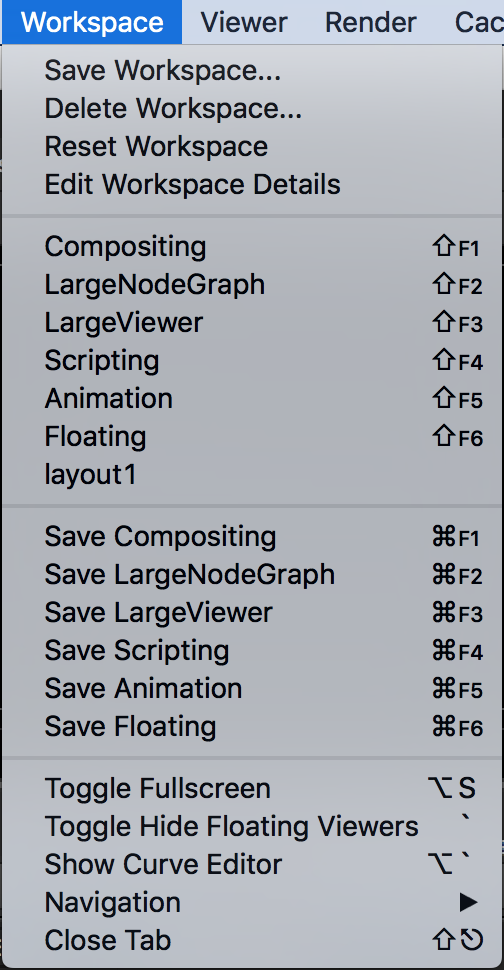
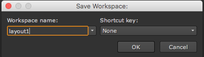
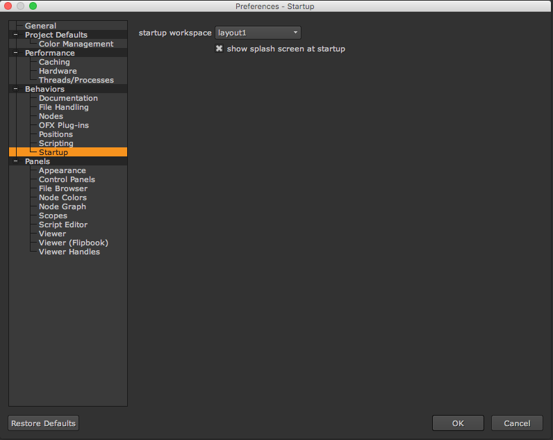

# Workspace

* 사용자의 작업창의 배치등을 저장, 불러올 때 사용합니다.
* Save Workspace로 저장후 뉴크가 최초 실행될 때 자동으로 불러오려면 설정부분에서 셋팅할 수 있습니다.

## 뉴크 시작시 사용자 설정을 자동으로 불러오기

* 원하는 레이아웃으로 셋팅후 Workspace &gt; Save Workspace 합니다.

* 뉴크의 설정창을 엽니다.\(Ctrl + ,\)
* 아래처럼 Startup탭에서 starup workspace항목을 기존 셋팅한 이름으로 바꾸어줍니다.

  

### Natron

* layout 이라는 용어를 사용합니다.
* 위 항목보다 메뉴가 적습니다.

