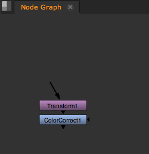
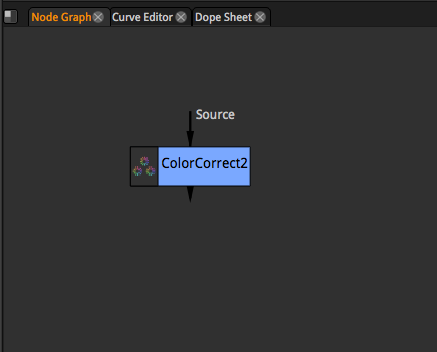

# Node\_graph

## Nuke

* 노드를 관리하는 창입니다.\(생성, 삭제, 연결등을 할 수 있는 공간입니다.\)

  

## 마우스 & 단축키

* 마우스 휠 : 노드그래프 확대 / 축소
* 마우스 가운데 버튼 : 노드그래프 이동
* 노드 더블클릭 : 각 노드의 설정창이 뜹니다.
* f : 노드를 뷰어에 맞도록 채움.
* l : 노드를 선택하고 l키를 누르면 노드가 정리됩니다.
* Ctrl : 노드와 노드 사이에 점을 찍을 수 있는 포인트 활성화.
* 1~0 : 노드 선택후 숫자버튼을 누르면 해당노드의 결과가 각 숫자 뷰어에 적용됩니다.

## Natron

