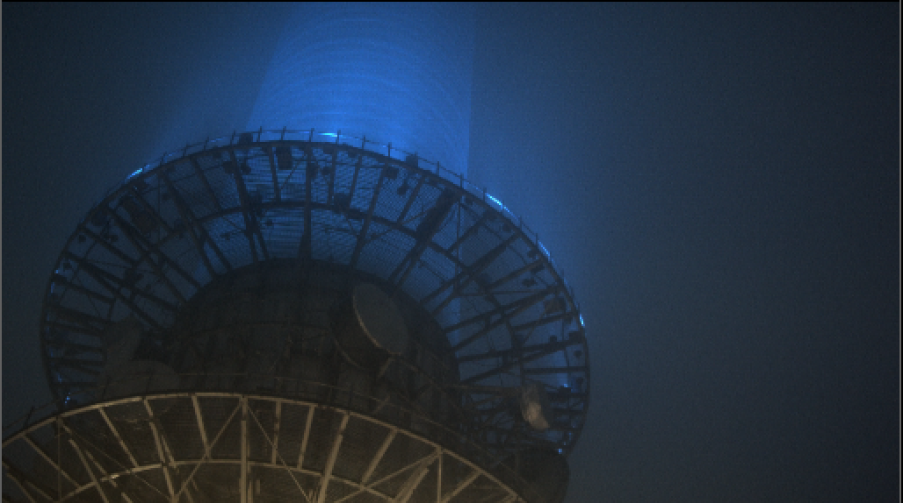
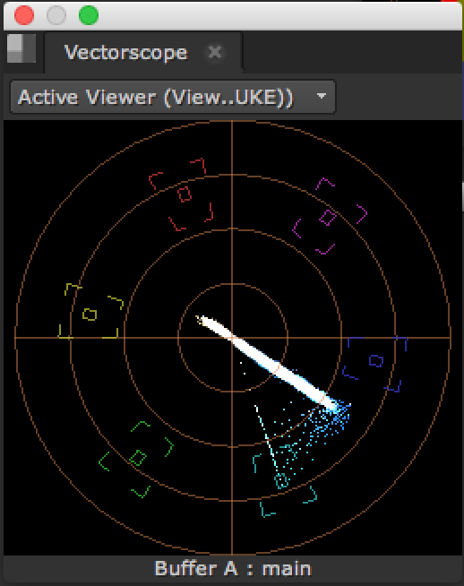

# Vectorscope

* 이미지의 색이 Hue 색상에서 어느정도의 채도양으로 분포되어있는지 확인 할 때 사용합니다.
* 보통 여러 상황에서 찍힌 이미지들중 주인공의 피부톤등을 일괄적으로 맞출때도 많이 사용합니다. 피부톤은 잘못 수정하면 미묘한 수치로 흑인, 백인, 황인등으로 바뀌게 됩니다.
* 예제에서는 블루에서 사이언 컬러 사이에 채도가 높은 픽셀들이 존재한다는 것을 알게되었네요.

## 예제파일

* [https://drive.google.com/open?id=0B3O\_eJlmdgJVUF84anlreXZELVU](https://drive.google.com/open?id=0B3O_eJlmdgJVUF84anlreXZELVU)

## Natron

* 아직 기능이 없습니다.

