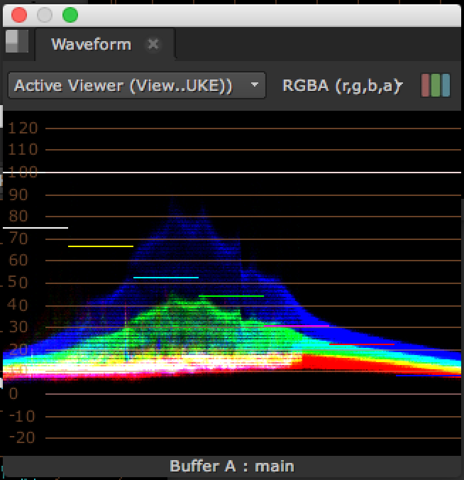

# Waveform

* 픽셀의 밝기를 X축으로 부터 그래프로 그릴 때 사용합니다.
* luma 값을 정확히 분석해야할 때 사용합니다.
* 예제에서는 전체적으로 푸른 톤을 가진 픽셀들이 값이 밝군요.

## 기타 예제

* 이 특징을 잘 활용하면 웨이브폼에서 글씨도 그릴 수 있습니다. 

  

* 여러분도 해보세요. 샘플뉴크파일 입니다. : [https://drive.google.com/open?id=0B3O\_eJlmdgJVUXFDRnVFZnhzejA](https://drive.google.com/open?id=0B3O_eJlmdgJVUXFDRnVFZnhzejA)

## 예제파일

* [https://drive.google.com/open?id=0B3O\_eJlmdgJVUF84anlreXZELVU](https://drive.google.com/open?id=0B3O_eJlmdgJVUF84anlreXZELVU)

## Natron

* 아직 기능이 없습니다.

