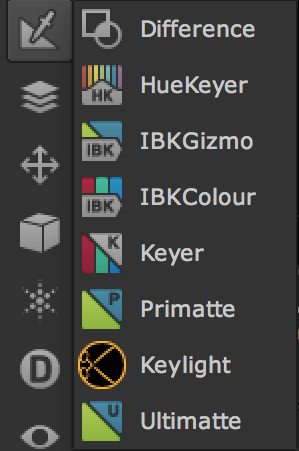
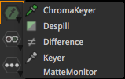

# Keyer

* 색의 특징을 이용해서 알파를 만들 수 있는 노드들로 구성되어있습니다.
* 위 역할을 하는 업무를 Keying 이라고 합니다.
* VFX 작업에서는 그린스크린, 블루스크린등이 사용됩니다.
* 샘플 플레이트 무료로 구하기 : [http://www.hollywoodcamerawork.com/greenscreenplates.html](http://www.hollywoodcamerawork.com/greenscreenplates.html)
* 4K ACES 플레이트 : [https://mango.blender.org/production/first-original-footage-frames-in-4k/](https://mango.blender.org/production/first-original-footage-frames-in-4k/)

## Natron

