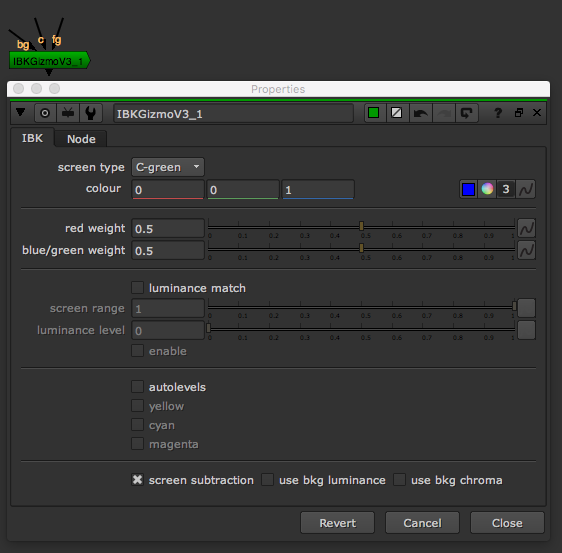

# IBKgizmo\_node

* IBK\(Image Based Keyer\) 키어입니다.
* IBKColour\_node 와 같이 쓰이기도 합니다.
* 실습을 통해서 배워봅시다.

## 예제파일

* 뉴크파일 : [https://drive.google.com/open?id=0B3O\_eJlmdgJVLWpQUHBJelljUzg](https://drive.google.com/open?id=0B3O_eJlmdgJVLWpQUHBJelljUzg)
* 소스 : [https://drive.google.com/open?id=0B3O\_eJlmdgJVNWRVUjNiQzVWNWs](https://drive.google.com/open?id=0B3O_eJlmdgJVNWRVUjNiQzVWNWs)

