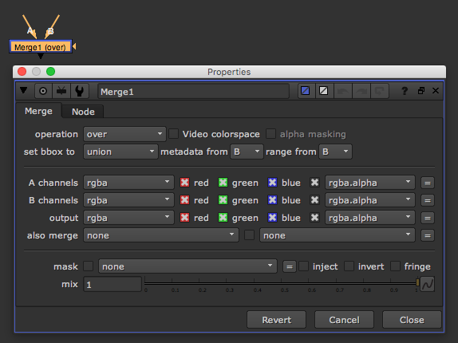

# Merge2\_node

* merge 노드를 알아봅시다.
* 2개의 이미지를 합쳐서 하나의 이미지로 만들 때 사용하는 노드입니다.
* 단축키 M 을 눌러서 보통 생성합니다.
* 보통 배경, 피사체가 분리되어있을 때 합치는 경우 많이 사용합니다.
* 여러가지 노드의 연산 옵션을 가지고  있습니다.
* A에는 보통 알파를 가진 Foreground가 연결되고, B에는 Background가 연결됩니다.

## 모드\(자세히\)

* operation 에 마우스를 올리면 각 모드에 사용중인 수학공식을 보여줍니다.
* 규칙1 : 대문자 A는 A에 연결된 RGB입니다.
* 규칙2 : 소문사 a는 A에 연결된 알파입니다.
* 규칙3 :대문자 B는 B에 연결된 RGB입니다.
* 규칙4 : 소문자 b는 B에 연결된 알파입니다.
* 공식 보기 : [http://help.thefoundry.co.uk/nuke/\#reference\_guide/merge\_nodes/merge.html](http://help.thefoundry.co.uk/nuke/#reference_guide/merge_nodes/merge.html)

