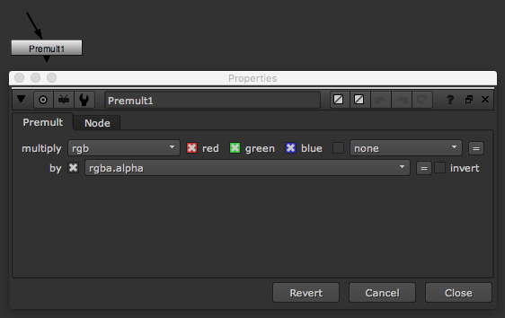

# Premult\_node

* R,G,B 채널을 자신의 알파와 곱할 때 사용합니다.
* Unpremult 노드와 보통 같이 친구처럼 사용됩니다.

## 사용이유

* 알파를 가진 렌더링된 이미지는 RGB채널의 각 수치보다 보통 A값이 큽니다.
* 위 특징으로 A채널 값이 크기 때문에 알파를 가진 이미지의 색을 그대로 돌리게 되면 엣지에 블랙이 생깁니다.
* 위 특징으로 컬러컬렉션시 RGB채널이 A채널보다 더 높을 값을 만들기 위해서 각채널을 A채널로 나눕니다.\(unpremult\)
* 색을 돌린후 다시 원래 가진 픽셀의 레벨로 돌리기 위해서 premult해줍니다.
* 뉴크는 똑똑해서 사실 ColorCorret 노드나 Grade처럼 컬러 노드는 내부적으로 Unpremult, premult 과정을 자동으로 해줍니다.

